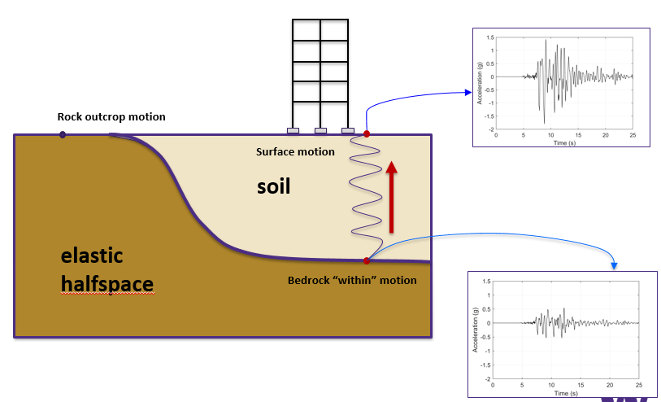
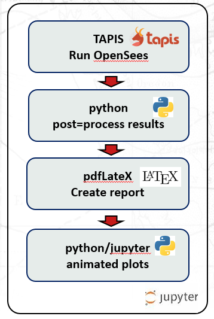
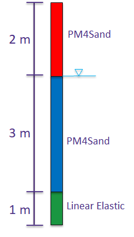
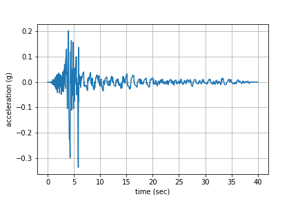
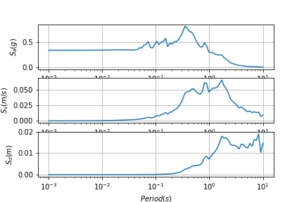
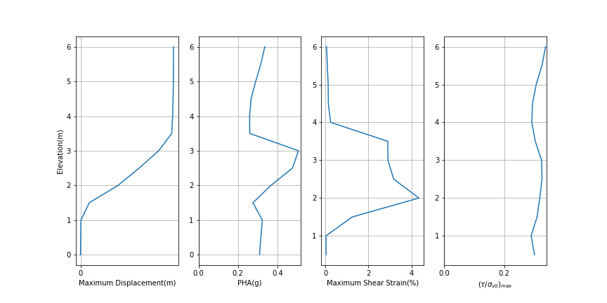
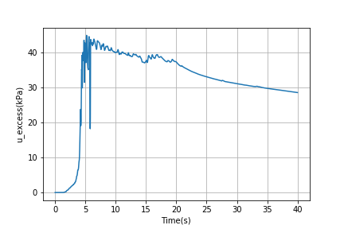
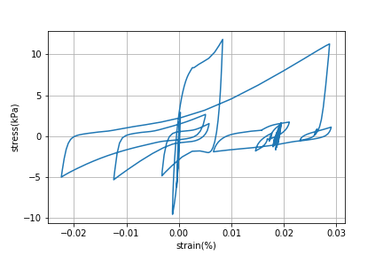

# From constitutive parameter calibration to site response analysis

**Authors, Affiliations**  

Pedro Arduino, University of Washington

A collection of educational notebooks to introduce model parameter calibration and site response analysis using OpenSees in DesignSafe-CI

## Background 

### Citation and Licensing

* Please cite [Arduino, P. et al. (2022)](https://doi.org/10.17603/ds2-3zdj-493) to acknowledge the use of any resources from this use case.

* Please cite [Rathje et al. (2017)](https://doi.org/10.1061/(ASCE)NH.1527-6996.0000246) to acknowledge the use of DesignSafe resources.  

* This software is distributed under the GNU General Public License (https://www.gnu.org/licenses/gpl-3.0.html).  

### Description 

Site response analysis for liquefiable soils is fundamental in the estimation of demands on civil infrastructure including buildings and lifelines. Current state of the art in numerical methods in geotechnical engineering require the use of advance constitutive models and fully couple nonlinear finite element (FEM) tools. Advanced constitutive models require calibration of material parameters based on experimental tests. These parameters include uncertainties that in turn propagate to uncertenties in the estimation of demands. The products included in this use-case provide simple examples showing how to achieve site response analysis including parameter identification and uncertainty quantification using SimCenter tools and the DesignSafe cyber infrastructure.

[//]: <{width=50%}>

<p align="center">

</p>
<p align="center"> <b>Fig.1 - Site response problem</b> </p>
    
[Link Example - this goes to Google](https://www.google.com)

This document presents a suite of Jupyter Notebooks published in DesignSafe that navigate the process of  constitutive model parameter calibration and site response analysis for a simple liquefaction case. They also introduce specific methods useful when using DesignSafe infrastructure in TACC. All notebooks leverage existing SimCenter backend functionality (e.g. Dakota, OpenSees, etc) implemented in quoFEM and run locally and in TACC through DesignSafe. Three notebooks are included for this purpose: 
1. **Site response workflow notebook**: This notebook introduces typical steps used in any site response workflow taking advantage of the Jupyter lab available in DesignSafe.
2. **Parameter calibration notebook**: This  notebook is customized for the PM4Sand model and present the estimation of its main parameters that best fit experimental data as well as their uncertainty.
3. **Propagation of parameter undertainty in site response analysis notebook**: This notebook introduces methods to propagate material parameter uncertainties in site reponse analysis.

The current version of this use-case page is a work in progress and includes details on the site response workflow notebook. The parameter calibration and propagation of uncertainties notebooks will be updated in a second version.

### Site response workflow notebook
The *site response workflow notebook* introduces typical steps used in the evaluation of the surface response for a site with liquefiable soil.
The notebook takes advantage of the site response problem to introduce a general numerical analysis workflow shown in Figure 2 that includes: 

1. running OpenSees using a **TAPIS** APP, 
2. postprocessing results using python, 
3. generating authomatic reports using pdflatex or rst2pdf, and 
4. Creating animated plots using visualization widgets. 

<p align="center">

</p>
<p align="center"> <b>Fig.2 - OpenSees numerical simulation workflow</>
b> </p>

A simple example of a liquefiable soil profile is used to demonstrate each step. The soil profile shown in Figure 3 includes a 5.0m loose sand underlain by a 1.0 dense soil.The loose sand is modeled using the PM4Sand constitutive model for liquefiable soils available in OpenSees. The dense sand is considered linear elastic. The groundwter table is assumed at 2.0m making the lower 3.0m of the loose sand susceptible to liquefaction. The soil profile is subject to a dynamic excitation at its base. The site response of interest includes surface acceleration, profiles of lateral displacement, horizontal acceleration, maximum shear strain, and cyclic stress ratio.  The model definition, analysis steps, and recorders are contained in the N10_T3.tcl file, and the input signal is in velocity.input. The model can be run using OpenSees in any OS framework.

[//]: <{width=50%}>
<p align="center">

</p>
<p align="center"> <b>Fig.3 - N10_T3 soil profile with liquefiable layer</b> </p>

The notebook, and required scripts, are available in the [DesignSafe/community](https://www.designsafe-ci.org/data/browser/public/designsafe.storage.community/Jupyter%20Notebooks%20for%20Civil%20Engineering%20Courses/University_of_Washington/freeFieldJupyterPM4Sand) folder and can be executed without any modification.
Users are invited to try it and use any parts of it.

The notebook can be broken down into four main components:

<ol type="a">
  <li>Setup TAPIS/AGAVE APP and run OpenSees job</li>
  <li>Post process results</li>
  <li>Generate report</li>
  <li>Generate interactive plots</li>
</ol>

It is emphasize that the main motivation of this notebook is to take advantage of DesignSafe resources. 
Therefore, relevant details for each component as it pertains to access to DesignSafe are described below.

### Setup tapis/agave app and run OpenSees job

The notebook can be executed launching *Jupyter Lab* in Designsafe. This opens a user *docker container* in DesignSafe that includes all the functionality required to execute jupyter commands. This gives immediate access to the **agavepy** module from which it is possible to run any **TAPIS** APP. 

#### Setup job description

A few commands are required to setup a TAPIS OpenSees job in DesignSafe. This requires definition of the TAPIS APP to use, and code input parameters. For the site response particular case the *OpenseesSp-3.3.0u1* app is selected. The main steps required to setup a job are: 

1. importing agave/tapis, 
2. getting the specific app of interest,
3. defining input folder locations, and parameters, and
4. encapsulating all data in a job_description array 

The python code below exemplifies these steps. The complete set of commands is available in the notebook. The job_description array includes all the information to submit the job.

```python
# Import Agave
from agavepy.agave import Agave
ag = Agave.restore()

# Get Agave app of interest
app_id = 'OpenseesSp-3.3.0u1'
app = ag.apps.get(appId=app_id)

# Define input folder and model parameters
cur_dir = cur_dir.split('MyData').pop() 
input_dir = ag.profiles.get()['username']+ cur_dir
input_filename = 'N10_T3_M.tcl'

inputs = {"inputDirectory": [ input_uri ]}
parameters = {"inputScript" : [input_filename]}

# Set job_description array
job_description = {}
job_description["appId"] = (app_id)
...
job_description["inputs"] = inputs
job_description["parameters"] = parameters
```

#### Run OpenSees Job

Submitting a job using DesignSafe HPC resources requires the use of agave job.submit(); and passing the job_description array as argument. Checking the status of a job can be done using jobs.getStatus(). The python code shown below exemplifies these commands.  When submitting a job, agave copies all the files present in the input folder to a temporary folder that is used during execution. After completion agave copies all the results to an archived folder. 

```python
import time
job = ag.jobs.submit(body=job_description)
print(" Job launched. Status provided below")
print(" Can also check in DedignSafe portal under - Workspace > Tools & Application > Job Status")

status = ag.jobs.getStatus(jobId=job["id"])["status"]
while status != "FINISHED":
    status = ag.jobs.getStatus(jobId=job["id"])["status"]
    print(f"Status: {status}")
    time.sleep(60)
```    

### Postprocess Results

Postprocessing requires identification of the location of the archived files. This is done interrogating agave about a particular job of interest and evaluating the correct folder location. The python code lines shown below exemplifly the steps required for this purpose. 

#### Identify job, archived location and user

``` python
jobinfo = ag.jobs.get(jobId=job.id)
jobinfo.archivePath
user = jobinfo.archivePath.split('/', 1)[0]

import os
%cd ..
cur_dir_name = cur_dir.split('/').pop() 
os.chdir(jobinfo.archivePath.replace(user,'/home/jupyter/MyData'))
if not os.path.exists(cur_dir_name):
    os.makedirs(cur_dir_name)
os.chdir(cur_dir_name)    
```
#### Plot Results

Once in the archived folder (cur_dir_name), postprocessing can be done using python scripts that operate on output files. For the particualar case of the site response analysis three scripts are used to evaluate:
1. surface acceleration time history and its response spectrum, 
2. profiles of maximum displacement, peak horizontal acceleration (PHA), peak shear strain, and cyclic stress ratio, and
3. Stress-strain and excess pore water pressure at the middle of the liquefiable layer.  

The python code and figures shown below exemplify these steps. All python scripts are available in the notebook community folder. 

Plot acceleration time hisotory and response spectra on log-linear scale
``` python
from plotAcc import plot_acc
plot_acc()
```
[//]: <>
[//]: <>
<p align="center">


</p>
<p align="center"> <b>Fig.4 - Surface acceleratio and response spectrum</b> </p>


Plot profiles
``` python
from plotProfile import plot_profile
plot_profile()
```
[//]: <>
<p align="center">

</p>
<p align="center"> <b>Fig.5 - Profiles of max displacement, PHA, Max shear strain and cyclic stress ratio</b> </p>

Plot excess pore water pressure
``` python
from plotPorepressure import plot_porepressure
plot_porepressure()
```

[//]: <>
<p align="center">


</p>
<p align="center"> <b>Fig.6 - stress strain and pore pressure in the middle of liquefiable layer</b> </p>


#### Generate report (pdflatex, rst2pdf) 

Generating a summary report is a convenient way to present results from lengthy simulations prcesses. In jupyter this can be done invoking any posprocessor available in the docker container image. Among them rst2pdf is commonly distributed with python. For the site response notebook a simple ShortReport.rst file is included that collects the results and plots generated in a simple pdf file. The python code shown below, exemplifies this process and include:
1. Running rst2pdf on ShortReport.rst
2. Posting the resulting pdf file in the jupyter notebook. For this it is convenient to define the PDF function shown below that specifies the format of the file in the screen. 

Run rst2pdf, assign to pdf_fn, and  call PDF show function 
``` python
import sys
!{sys.executable} -m pip install rst2pdf
os.system('rst2pdf ShortReport.rst ShortReport.pdf')

pdf_fn = jobinfo.archivePath.replace(user, '/user/' + user + '/files/MyData')
pdf_fn += '/'
pdf_fn += cur_dir.split('/')[-1]
pdf_fn += '/ShortReport.pdf'
print pdf_fn

PDF(pdf_fn , (750,600))
```

PDF function 
``` python
class PDF(object):
  def __init__(self, pdf, size=(200,200)):
    self.pdf = pdf
    self.size = size

  def _repr_html_(self):
    return '<iframe src={0} width={1[0]} height={1[1]}></iframe>'.format(self.pdf, self.size)

  def _repr_latex_(self):
    return r'\includegraphics[width=1.0\textwidth]{{{0}}}'.format(self.pdf)
```

#### Create Interactive Plots

Finally, jupyter notebooks offer the flexibility to invoke GUI widgets that can help present results in a dynamic and interactive manner. The python scripts shown below create interactive plots for pore water pressure and soil profile lateral displacements. The horizontal bars allow the user question each plot for results at any particular time. Complete pyhon scripts are included in the notebook folder in community.   

Pore water pressure
``` python
from interactiveplot import createpwpplot, createDispplot
createpwpplot()
```
Displacement 
``` python
createDispplot()
```