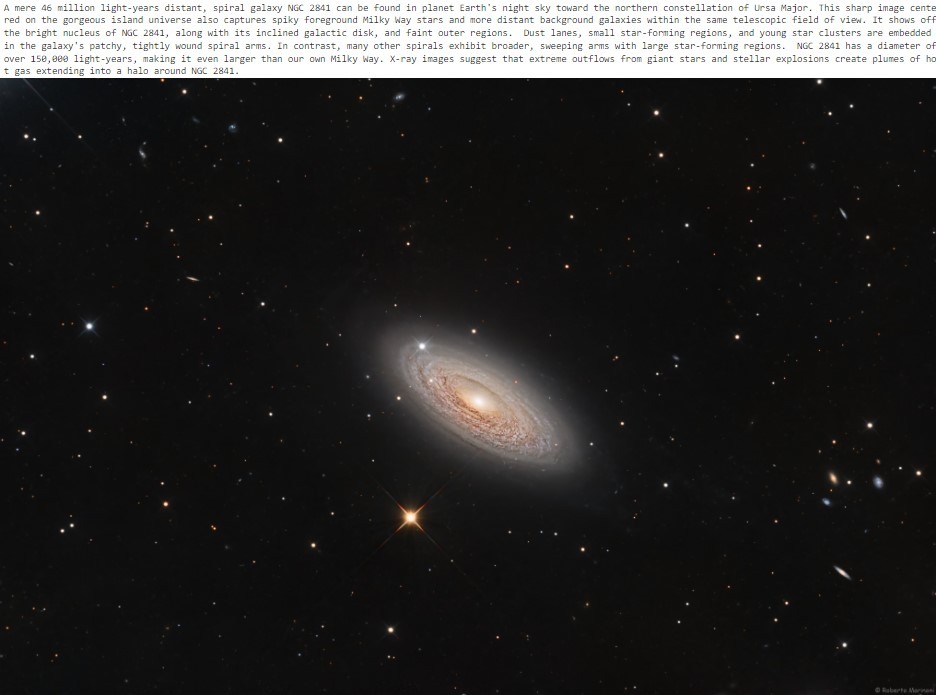

# What is an API?

An Application Programming Interface (API) is a program that enables communication between two software components, typically on different computers. For simplicity, we'll refer to a client and a server as the two different software components. Many API's are configured such that the client submits information to the server via a query string at the end of a Uniform Resource Locator (URL). The server receives the URL, parses the query string, runs a script to gather requested information often by querying a relational database, and returns the data to the client in the requested format. Example formats include html, xml, json, or plain text.

A primary benefit of API's is that users can retrieve information from the database using intuitive query string parameters, without requiring users to understand the structure of the database. Furthermore, databases are generally configured to reject queries originating from another computer for security reasons. The API is a middle-layer that allows users to submit a request to the server, but the query itself then originates from the same server that hosts the database.

# Authentication, Authorization, Keys, and Tokens

Authentication verifies the identity of a user, generally by entering a username and password, and sometimes through additional measures like multi-factor authentication. When a user authenticases through a website, the server may store information about that user in a manner that persists through the user session. 

Authorization determines the access rights extended to a user. For example, a particular user may have access to only their own data when they log in to a website, but they are not permitted to see other users' data.

API's are often stateless, meaning that the server does not store any information about the client session on the server-side. As a result, the request submitted by the client must contain all of the necessary information for the server to authenticate the user, and verify that the user is authorized to make the request, before completing the request. Keys and tokens are text strings that are generated by the server and provided to a user. The user must then pass the API key or token from the client to the server as part of authentication and/or authorization.

API keys are designed to identify the client to the server. In some cases you may need to request a key for a particular API, and generally that key will remain the same and you'll need to include it with your API requests.

Tokens are similar to keys in that they are text strings, but they often carry additional information required to authenticate and authorize the uesr (i.e., the token bearer). Tokens are often generated when a user authenticates, and set to expire after a specified time period, at which point the user must re-authenticate to obtain a new token.

# Example API

NASA maintains an API to deliver the Astronomy Picture of the Day, or APOD. Below is an example query.

https://api.nasa.gov/planetary/apod?api_key=DEMO_KEY

Running this query produces a JSON string, like the one shown below, that contains information about the image, including an explanation, and links to versions of the image with different resolution.

```json
{"copyright":"Roberto Marinoni","date":"2023-03-23","explanation":"A mere 46 million light-years distant, spiral galaxy NGC 2841 can be found in planet Earth's night sky toward the northern constellation of Ursa Major. This sharp image centered on the gorgeous island universe also captures spiky foreground Milky Way stars and more distant background galaxies within the same telescopic field of view. It shows off the bright nucleus of NGC 2841, along with its inclined galactic disk, and faint outer regions.  Dust lanes, small star-forming regions, and young star clusters are embedded in the galaxy's patchy, tightly wound spiral arms. In contrast, many other spirals exhibit broader, sweeping arms with large star-forming regions.  NGC 2841 has a diameter of over 150,000 light-years, making it even larger than our own Milky Way. X-ray images suggest that extreme outflows from giant stars and stellar explosions create plumes of hot gas extending into a halo around NGC 2841.","hdurl":"https://apod.nasa.gov/apod/image/2303/NGC2841_Astrobin.jpg","media_type":"image","service_version":"v1","title":"Spiral Galaxy NGC 2841","url":"https://apod.nasa.gov/apod/image/2303/NGC2841_1024.jpg"}
```

While entering the URL into a web browser returns useful information in the form of the JSON string, it does not actually display the image. Users could cut and paste the desired URL into their browser to render the image. But the real power of the API is unlocked by interacting with it programatically rather than through a browser window. The example code below uses the Python requests package to submit the request to the APOD server, and the PIL package to plot the image below its caption.

```python
import requests
import json
from PIL import Image
from io import BytesIO

# Submit API request and assign returned data to a variable called r
r = requests.get('https://api.nasa.gov/planetary/apod?api_key=DEMO_KEY')

# Convert returned JSON string into a Python dictionary using the json package
r_dict = json.loads(r.text)

# Extract explanation and URL for HD version of image
explanation = r_dict['explanation']
hdurl = r_dict['hdurl']

# Submit request for image data and plot the explanation and image
r_img = requests.get(hdurl)
img = Image.open(BytesIO(r_img.content))
print(explanation)
img
```

Example output from this script is shown below.


