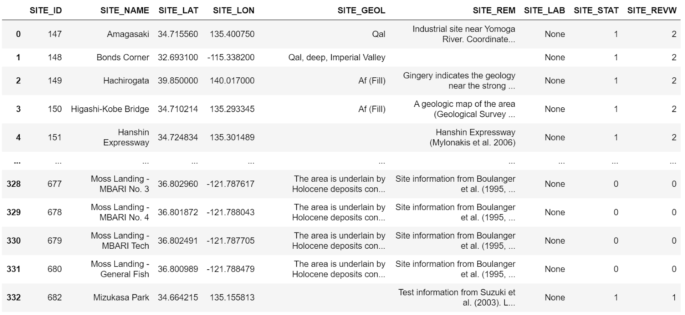
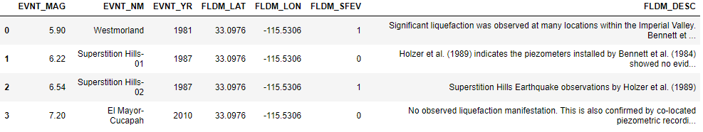
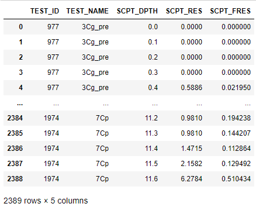
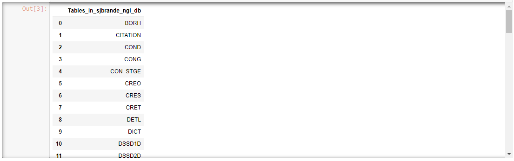

# Next Generation Liuqefaction (NGL) Database Jupyter Notebooks

**Brandenberg, S.J., UCLA, Ulmer, K.J., Southwest Research Institute, and Zimmaro, P., University of Calabria**  

The Next Generation Liquefaction (NGL) Project is advancing the state of the art in liquefaction research 
and working toward providing end users with a consensus approach to assess liquefaction potential within 
a probabilistic and risk-informed framework. Specifically, NGL’s goal is to first collect and organize 
liquefaction information in a common and comprehensive database to provide all researchers with a 
substantially larger, more consistent, and more reliable source of liquefaction data than existed previously. 
Based on this database, we will create probabilistic models that provide hazard- and risk-consistent bases 
for assessing liquefaction susceptibility, the potential for liquefaction to be triggered in susceptible soils, 
and the likely consequences. NGL is committed to an open and objective evaluation and integration of data, 
models and methods, as recommended in a 2016 National Academies [report](https://www.nap.edu/catalog/23474/state-of-the-art-and-practice-in-the-assessment-of-earthquake-induced-soil-liquefaction-and-its-consequences). 

The evaluation and integration of the data into new models and methods will be clear and transparent. Following these principles will ensure 
that the resulting liquefaction susceptibility, triggering, and consequence models are reliable, robust and 
vetted by the scientific community, providing a solid foundation for designing, constructing and overseeing 
critical infrastructure projects.

The NGL database is populated through a web GUI at www.nextgenerationliquefaction.org/. The web interface 
provides limited capabilities for users to interact with data. Users are able to view and download data, 
but they cannot use the GUI to develop an end-to-end workflow to make scientific inferences and draw conclusions 
from the data. To facilitate end-to-end workflows, the NGL database is replicated daily to [DesignSafe](https://www.designsafe-ci.org), where 
users can interact with it using Jupyter notebooks.

## Citation and Licensing

* Please cite [Zimmaro, P., et al. (2019)](https://doi.org/10.21222/C2J040) to acknowledge the use of the NGL Database. Data in the NGL database has been gathered from [these](https://nextgenerationliquefaction.org/citations.php) published sources. If you use specific data in the database, please cite the original source.

* Please cite [Rathje et al. (2017)](https://doi.org/10.1061/(ASCE)NH.1527-6996.0000246) to acknowledge the use of DesignSafe resources.  

* This software is distributed under the GNU General Public License (https://www.gnu.org/licenses/gpl-3.0.html).  


## Installing Database Connection Script
 
Connecting to a relational database requires credentials, like username, password, database name, and hostname. 
Rather than requiring users to know these credentials, we have created a Python package that allows users to 
connect to the database. This code installs the package containing the database connection script for NGL:

```python
!pip install designsafe_db
```

## Querying the Database

This section illustrates how to query the NGL database, and the example queries are contained in a [Jupyter Notebook on DesignSafe](https://jupyter.designsafe-ci.org/user/name/tree/CommunityData/NGL/ExampleQueries.ipynb).

### Query contents of SITE table

The lines of code below first imports the ngl_db Python package, then creates a query to read all data from the SITE table, then creates a Pandas dataframe by executing the read_sql command that is part of the designsafe_db.ngl_db package.

```python
import designsafe_db.ngl_db as ngl
sql = "SELECT * FROM SITE"
df = ngl.read_sql(sql)
```

The output from the command is illustrated in the figure below. When this query was written, there were a total of 333 sites in 
the NGL database. The SITE_ID field is not contiguous because sites are sometimes deleted from the database, and the 
SITE_ID field is never re-used. The Pandas dataframe is broken between SITE_ID 151 and 677 for ease of displaying 
information in the output window. Many rows of data are not displayed in Figure 1 as a result.



**Figure 1.** Results of query of SITE table data.

### Query Wildlife liquefaction array data

This cell queries event information from the EVNT table and surface evidence of liquefaction information from the FLDM table at the Wildlife Array site. The definition of each table and site is below. The query utilizes an INNER JOIN statement to combine tables based on shared keys, and will return all values that have matching keys in both tables. For more details, see <https://www.w3schools.com/sql/sql_join_inner.asp>

**Table 1.** List of tables utilized in Wildlife liquefaction array queries.

| Table	| Description |
| ----- | ----------- |
| EVNT	| 	Earthquake event information |
| FLDM	| 	Field evidence of liquefaction information at a point within a site |
| FLDO	| 	Field evidence of liquefaction information at a site |
| SITE	| 	A site is the highest level organizational structure for information in the database |

**Table 2.** List of fields utilized in Wildlife liquefaction array queries.

| Field	| Description |
| ----- | ----------- |
| EVNT_MAG | 	Earthquake magnitude |
| EVNT_NM | 	  Event name |
| EVNT_YR | 	  Event year |
| FLDM_LAT | 	Latitude of manifestation observation |
| FLDM_LON | 	Longitude of manifestation observation |
| FLDM_SFEV | 	Indication of whether surface manifestation occurred (0 = no, 1 = yes) |
| FLDM_DESC | 	Description of liquefaction manifestation |
| FLDO_ID |    Primary key in FLDO table, and foreign key in FLDM table |
| EVNT_ID |    Primary key in EVNT table, and foreign key in FLDO table |
| SITE_ID |    Primary key in SITE table, and foreign key in FLDO table |
| SITE_NAME |  Site name |

```python
import designsafe_db.ngl_db as ngl

sql = 'SELECT EVNT.EVNT_MAG, EVNT.EVNT_NM, EVNT.EVNT_YR, FLDM.FLDM_LAT, FLDM.FLDM_LON, FLDM.FLDM_SFEV, FLDM.FLDM_DESC '
sql += 'FROM FLDO INNER JOIN FLDM on FLDO.FLDO_ID = FLDM.FLDO_ID '
sql += 'INNER JOIN EVNT ON EVNT.EVNT_ID = FLDO.EVNT_ID '
sql += 'INNER JOIN SITE ON FLDO.SITE_ID = SITE.SITE_ID '
sql += 'WHERE SITE_NAME = "Wildlife Array"'

df = ngl.read_sql(sql)
pd.set_option('display.max_colwidth', 100)
df
```


  

**Figure 2.** Screenshot of result of query of Wildlife liquefaction array query of event information and field observations.

## Query Wildlife liquefaction CPT data

This query retrieves all cone penetration test data from the Wildlife liquefaction array. INNER JOIN statements are needed to link SCPT to SCPG (using SCPG_ID), SCPG to TEST (using TEST_ID), and TEST to SITE (using SITE_ID). This query demonstrates propagation of primary and foreign keys through the schema heirarchy.

```python  
import pandas as pd
import designsafe_db.ngl_db as ngl

command = 'SELECT TEST.TEST_ID, TEST.TEST_NAME, SCPT. SCPT_DPTH, SCPT.SCPT_RES, SCPT.SCPT_FRES FROM SCPT '
command += 'INNER JOIN SCPG ON SCPT.SCPG_ID = SCPG.SCPG_ID '
command += 'INNER JOIN TEST ON TEST.TEST_ID = SCPG.TEST_ID '
command += 'INNER JOIN SITE ON SITE.SITE_ID = TEST.SITE_ID '
command += 'WHERE SITE.SITE_NAME = "Wildlife Array"'

df = ngl.read_sql(command)
pd.set_option('display.max_rows', 10)
df
```



**Figure 3.** Screenshot of result of query of Wildlife liquefaction array query of cone penetration test data.

## Query list of table names

The cell below queries the names of all of the tables in the NGL database into a Pandas dataframe. By default, Pandas truncates dataframes for compact viewing. The cell below illustrates how to use the "set_option" command to set the number of rows to a custom value, in this case the length of the Pandas dataframe.

```python
import pandas as pd
import designsafe_dg.ngl_db as ngl

sql = 'show tables'
table_names = ngl.read_sql(sql)
pd.set_option('display.max_rows', len(table_names))
table_names
```


**Figure 4.** Screenshot of list of tables in NGL database.
    
## Query schema for BORH table

The BORH table is the first in the alphebetical list of tables. A description of the headings returned by the DESCRIBE command is in the table below.

**Table 3.** List of headings describing fields in table returned by SQL DESCRIBE command.

| Column  |  Description |
| ------  |  ----------- |
| Field  |     Name of table entry |
| Type |       Datatype of entry |
| Null  |      YES = null fields are allowed, NO = null fields are not allowed |
| Key   |      PRI = Primary key, MUL = Foreign key |
| Default  |   Default value |
| Extra   |    auto_increment = value is automatically assigned incrementally |

The cell below uses the SHOW FULL COLUMNS command to display the fields in the BORH table. This includes a "Comment" that defines each field.

```python
import pandas as pd
import designsafe_db.ngl_db as ngl

sql = 'SHOW FULL COLUMNS FROM BORH'
bohr_desc = ngl.read_sql(sql, cnx)
pd.set_option('display.max_rows', len(bohr_desc))
bohr_desc
```


**Figure 8.** Screenshot of fields contained in BORH table. 
