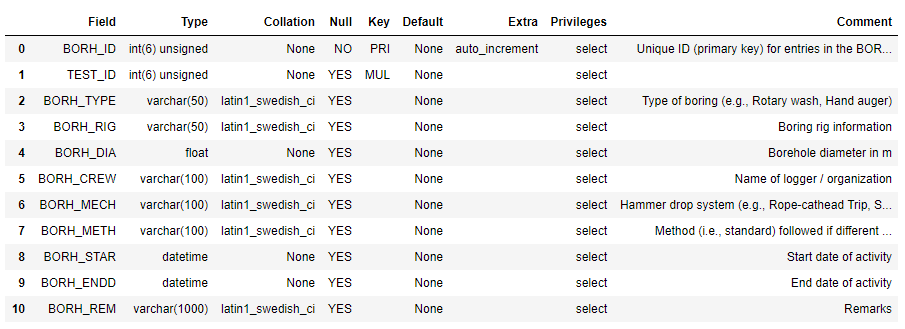

# Next Generation Liuqefaction (NGL) Database Jupyter Notebooks

**Brandenberg, S.J., UCLA, Ulmer, K.J., Southwest Research Institute, and Zimmaro, P., University of Calabria**  

The Next Generation Liquefaction (NGL) Project is advancing the state of the art in liquefaction research 
and working toward providing end users with a consensus approach to assess liquefaction potential within 
a probabilistic and risk-informed framework. Specifically, NGL’s goal is to first collect and organize 
liquefaction information in a common and comprehensive database to provide all researchers with a 
substantially larger, more consistent, and more reliable source of liquefaction data than existed previously. 
Based on this database, we will create probabilistic models that provide hazard- and risk-consistent bases 
for assessing liquefaction susceptibility, the potential for liquefaction to be triggered in susceptible soils, 
and the likely consequences. NGL is committed to an open and objective evaluation and integration of data, 
models and methods, as recommended in a 2016 National Academies [report](https://www.nap.edu/catalog/23474/state-of-the-art-and-practice-in-the-assessment-of-earthquake-induced-soil-liquefaction-and-its-consequences). 

The evaluation and integration of the data into new models and methods will be clear and transparent. Following these principles will ensure 
that the resulting liquefaction susceptibility, triggering, and consequence models are reliable, robust and 
vetted by the scientific community, providing a solid foundation for designing, constructing and overseeing 
critical infrastructure projects.

The NGL database is populated through a web GUI at www.nextgenerationliquefaction.org/. The web interface 
provides limited capabilities for users to interact with data. Users are able to view and download data, 
but they cannot use the GUI to develop an end-to-end workflow to make scientific inferences and draw conclusions 
from the data. To facilitate end-to-end workflows, the NGL database is replicated daily to [DesignSafe](https://www.designsafe-ci.org), where 
users can interact with it using Jupyter notebooks.

## Citations and Licensing

* Please cite [Zimmaro, P., et al. (2019)](https://doi.org/10.21222/C2J040) to acknowledge the use of the NGL Database. Data in the NGL database has been gathered from [these](https://nextgenerationliquefaction.org/citations.php) published sources. If you use specific data in the database, please cite the original source.

* Please cite [Rathje et al. (2017)](https://doi.org/10.1061/(ASCE)NH.1527-6996.0000246) to acknowledge the use of DesignSafe resources.  

* This software is distributed under the GNU General Public License (https://www.gnu.org/licenses/gpl-3.0.html).  

## Understanding the Database Schema

The NGL database is organized into tables that are related to each other via keys. To query the database, 
you will need to understand the organizational structure of the database, called the schema. The database 
schema is documented at the following URL:

<https://nextgenerationliquefaction.org/schema/index.html>
  
## Installing Database Connection Script
 
Connecting to a relational database requires credentials, like username, password, database name, and hostname. 
Rather than requiring users to know these credentials, we have created a Python package that allows users to 
connect to the database. This code installs the package containing the database connection script for NGL:

```python
!pip install designsafe_db
```

## Querying the Database

This section illustrates how to query the NGL database, and the example queries are contained in a [Jupyter Notebook on DesignSafe](https://jupyter.designsafe-ci.org/user/name/tree/CommunityData/NGL/ExampleQueries.ipynb).

### Query contents of SITE table

The lines of code below first imports the ngl_db Python package, then creates a query to read all data from the SITE table, then creates a Pandas dataframe by executing the read_sql command that is part of the designsafe_db.ngl_db package.

```python
import designsafe_db.ngl_db as ngl
sql = "SELECT * FROM SITE"
df = ngl.read_sql(sql)
```

The output from the command is illustrated in the figure below. When this query was written, there were a total of 333 sites in 
the NGL database. The SITE_ID field is not contiguous because sites are sometimes deleted from the database, and the 
SITE_ID field is never re-used. The Pandas dataframe is broken between SITE_ID 151 and 677 for ease of displaying 
information in the output window. Many rows of data are not displayed in Figure 1 as a result.


**Figure 1.** Results of query of SITE table data.

### Query Wildlife liquefaction array data

This cell queries event information from the EVNT table and surface evidence of liquefaction information from the FLDM table at the Wildlife Array site. The definition of each table and site is below. The query utilizes an INNER JOIN statement to combine tables based on shared keys, and will return all values that have matching keys in both tables. For more details, see <https://www.w3schools.com/sql/sql_join_inner.asp>

**Table 1.** List of tables utilized in Wildlife liquefaction array queries.

| Table	| Description |
| ----- | ----------- |
| EVNT	| 	Earthquake event information |
| FLDM	| 	Field evidence of liquefaction information at a point within a site |
| FLDO	| 	Field evidence of liquefaction information at a site |
| SITE	| 	A site is the highest level organizational structure for information in the database |

**Table 2.** List of fields utilized in Wildlife liquefaction array queries.

| Field	| Description |
| ----- | ----------- |
| EVNT_MAG | 	Earthquake magnitude |
| EVNT_NM | 	  Event name |
| EVNT_YR | 	  Event year |
| FLDM_LAT | 	Latitude of manifestation observation |
| FLDM_LON | 	Longitude of manifestation observation |
| FLDM_SFEV | 	Indication of whether surface manifestation occurred (0 = no, 1 = yes) |
| FLDM_DESC | 	Description of liquefaction manifestation |
| FLDO_ID |    Primary key in FLDO table, and foreign key in FLDM table |
| EVNT_ID |    Primary key in EVNT table, and foreign key in FLDO table |
| SITE_ID |    Primary key in SITE table, and foreign key in FLDO table |
| SITE_NAME |  Site name |

```python
import designsafe_db.ngl_db as ngl

sql = 'SELECT EVNT.EVNT_MAG, EVNT.EVNT_NM, EVNT.EVNT_YR, FLDM.FLDM_LAT, FLDM.FLDM_LON, FLDM.FLDM_SFEV, FLDM.FLDM_DESC '
sql += 'FROM FLDO INNER JOIN FLDM on FLDO.FLDO_ID = FLDM.FLDO_ID '
sql += 'INNER JOIN EVNT ON EVNT.EVNT_ID = FLDO.EVNT_ID '
sql += 'INNER JOIN SITE ON FLDO.SITE_ID = SITE.SITE_ID '
sql += 'WHERE SITE_NAME = "Wildlife Array"'

df = ngl.read_sql(sql)
pd.set_option('display.max_colwidth', 100)
df
```


  

**Figure 2.** Screenshot of result of query of Wildlife liquefaction array query of event information and field observations.

### Query Wildlife liquefaction CPT data

This query retrieves all cone penetration test data from the Wildlife liquefaction array. INNER JOIN statements are needed to link SCPT to SCPG (using SCPG_ID), SCPG to TEST (using TEST_ID), and TEST to SITE (using SITE_ID). This query demonstrates propagation of primary and foreign keys through the schema heirarchy.

```python  
import pandas as pd
import designsafe_db.ngl_db as ngl

command = 'SELECT TEST.TEST_ID, TEST.TEST_NAME, SCPT. SCPT_DPTH, SCPT.SCPT_RES, SCPT.SCPT_FRES FROM SCPT '
command += 'INNER JOIN SCPG ON SCPT.SCPG_ID = SCPG.SCPG_ID '
command += 'INNER JOIN TEST ON TEST.TEST_ID = SCPG.TEST_ID '
command += 'INNER JOIN SITE ON SITE.SITE_ID = TEST.SITE_ID '
command += 'WHERE SITE.SITE_NAME = "Wildlife Array"'

df = ngl.read_sql(command)
pd.set_option('display.max_rows', 10)
df
```


**Figure 3.** Screenshot of result of query of Wildlife liquefaction array query of cone penetration test data.

### Query list of table names

The cell below queries the names of all of the tables in the NGL database into a Pandas dataframe. By default, Pandas truncates dataframes for compact viewing. The cell below illustrates how to use the "set_option" command to set the number of rows to a custom value, in this case the length of the Pandas dataframe.

```python
import pandas as pd
import designsafe_dg.ngl_db as ngl

sql = 'show tables'
table_names = ngl.read_sql(sql)
pd.set_option('display.max_rows', len(table_names))
table_names
```


**Figure 4.** Screenshot of list of tables in NGL database.
    
### Query schema for BORH table

The BORH table is the first in the alphebetical list of tables. A description of the headings returned by the DESCRIBE command is in the table below.

**Table 3.** List of headings describing fields in table returned by SQL DESCRIBE command.

| Column  |  Description |
| ------  |  ----------- |
| Field  |     Name of table entry |
| Type |       Datatype of entry |
| Null  |      YES = null fields are allowed, NO = null fields are not allowed |
| Key   |      PRI = Primary key, MUL = Foreign key |
| Default  |   Default value |
| Extra   |    auto_increment = value is automatically assigned incrementally |

The cell below uses the SHOW FULL COLUMNS command to display the fields in the BORH table. This includes a "Comment" that defines each field.

```python
import pandas as pd
import designsafe_db.ngl_db as ngl

sql = 'SHOW FULL COLUMNS FROM BORH'
bohr_desc = ngl.read_sql(sql, cnx)
pd.set_option('display.max_rows', len(bohr_desc))
bohr_desc
```



**Figure 5.** Screenshot of fields contained in BORH table. 

## Cone Penetration Test Viewer

The cone penetration test viewer demonstrates the following:

1. Connecting to NGL database in DesignSafe
2. Querying data from SITE, TEST, SCPG, and SCPT tables into Pandas dataframes
3. Creating dropdown widgets using the ipywidgets package to allow users to select site and test data
4. Creating HTML widget for displaying metadata after a user select a test
5. Using the ipywidgets "observe" feature to call functions when users select a widget value
6. Plotting data from the selected cone penetration test using matplotlib

Cone penetration test data plotted in the notebook include tip resistance, sleeve friction, and pore pressure. In some cases, sleeve friction and pore pressure are not measured, in which case the plots are empty.

## Jupyter notebook
[Jupyter notebook on DesignSafe](https://jupyter.designsafe-ci.org/user/name/tree/CommunityData/NGL/CPT_viewer.ipynb)

## Tables
Tables queried in this notebook, and the fields within those tables are described in the tables below.

### List of Tables

| Table | Description |
| ----- | ----------- |
| SITE  | Highest level table that serves as the organizational structure for project team collaboration |
| TEST  | Table containing descriptions of tests including CPT, boreholes, geophysical tests, and groundwater measurements |
| SCPG  | Table containing metadata about CPT test |
| SCPT  | Table containing CPT test data |

### SITE Table

| Field   | Description |
| -----   | ----------- |
| SITE_ID | Primary key for the site table |
| SITE_NAME | Site name (appears in site_widget dropdown) |

### TEST Table

| Field   | Description |
| -----   | ----------- |
| TEST_ID |  Primary key for TEST table |
| SITE_ID |  Foreign key from SITE table associating a test with a site |
| TEST_NAME | Test name (appears in test_widget dropdown) |

### SCPG Table

| Field   | Description |
| -----   | ----------- |
| SCPG_ID | Primary key for SCPG table |
| TEST_ID |  Foreign key from TEST table associating a cone penetration test with a test |
| SCPG_CSA | Surface area of the cone tip in square centimeters |
| SCPG_RATE | Nominal rate of penetration of the cone in cm/s |
| SCPG_CREW | Name of logger / organization |
| SCPG_METH | Penetration method |
| SCPG_STAR | Start date of activity |
| SCPG_ENDD | End date of activity |
| SCPG_PWP  | Position of pore pressure measurement on cone |
| SCPG_REM  | Remarks |

### SCPT Table

| Field   | Description |
| -----   | ----------- |
| SCPT_ID |   Primary key for SCPT Table   |
| SCPG_ID |   Foreign key from SCPG table associating cone penetratin test data with test metadata | 
| SCPG_DPTH | Depth of CPT measurement in m |
| SCPT_RES  | Cone tip resistance (qc) in MPa |
| SCPT_FRES | Sleeve friction resistance (fs) in MPa | 
| SCPT_PWP  | Pore-water pressure in MPa |

## Code

This section describes the [Jupyter notebook](https://jupyter.designsafe-ci.org/user/name/notebooks/CommunityData/NGL/CPT_viewer.ipynb) available via DesignSafe. The code is broken into chunks with explanations of each section of code.

### Import packages

In this case, we need to import ipywidgets, matplotlib, numpy, ngl_db, and pandas. The "%matplotlib notebook" magic renders an interactive plot in the notebook.

```python
%matplotlib notebook
import ipywidgets as widgets
from matplotlib import pyplot as plt
import numpy as np
import designsafe_db.ngl_db as ngl
import pandas as pd
```

### Query distinct SITE_ID and SITE_NAME for sites that have CPT data
The query below finds distinct SITE_ID and SITE_NAME fields that contain CPT data for the purpose of populating the site dropdown widget. 
INNER JOIN commands are required between SITE, TEST, and SCPG to find sites containing CPT data.
A site might contain more than one CPT test, but we do not want replicated fields in the site dropdown widget. Therefore we use the "DISTINCT" command.

```python
sql = 'SELECT DISTINCT SITE.SITE_ID, SITE.SITE_NAME FROM SITE INNER JOIN TEST ON SITE.SITE_ID = TEST.SITE_ID INNER JOIN SCPG ON SCPG.TEST_ID = TEST.TEST_ID'
site_df = ngl.read_sql_query(sql)
```

### Create key, value pairs for SITE_NAME and SITE_ID, and create site_widget
Dropdown widgets accept key-value pairs for the "options" field. This is desireable here because the SITE_ID can be set to the key, and subsequently utilized in queries when a user selects a site. The code below converts queried site data into name, value pairs.

```python
site_df.set_index('SITE_ID',inplace=True)
site_df.sort_values(by='SITE_NAME',inplace=True)
site_options = [('Select a site', -1)]
for key, value in site_df['SITE_NAME'].to_dict().items():
    site_options.append((value, key))
site_widget = widgets.Dropdown(options=site_options, description='Site')
``` 

### Create empty test_widget. This widget will get populated when a site is selected

```python
test_options = [('Select a test', -1)]
test_widget = widgets.Dropdown(options=test_options, description='Test', disabled=True)
widget_box= widgets.VBox([site_widget, test_widget])
display(widget_box)
```

### Create plot objects and initialize empty plots

```python
fig, ax = plt.subplots(1, 3, figsize=(6,4), sharey='row')

line1, = ax[0].plot([], [])
ax[0].set_xlabel('qc (MPa)')
ax[0].set_ylabel('depth (m)')
ax[0].grid(True)
ax[0].invert_yaxis()

line2, = ax[1].plot([], [])
ax[1].set_xlabel('fs (MPa)')
ax[1].grid(True)
ax[1].invert_yaxis()

line3, = ax[2].plot([], [])
ax[2].set_xlabel('u2 (MPa)')
ax[2].grid(True)
ax[2].invert_yaxis()

fig.tight_layout()
```

### Create empty metadata_widget. This widget will get populated when a CPT test is selected

```python
metadata_widget = widgets.HTML(value='')
display(metadata_widget)
```

### Define function for populating test_widget when a user selects a site from the site_widget dropdown

This code sets data for the plots to be empty, and sets the metadata widget to be empty as well. If the top-level field is selected (i.e., 'Select a Test'), then the test_widget is disabled.
If a site is selected, a SQL query is made on all of the CPT tests for that site, and the test dropdown is populated.

```python
def on_site_widget_change(change):
   line1.set_xdata([])
   line1.set_ydata([])
   line2.set_xdata([])
   line2.set_ydata([])
   line3.set_xdata([])
   line3.set_ydata([])
   metadata_widget.value=''
   if(change['new']==-1):
       test_widget.options = [('Select a test', -1)]
       test_widget.disabled = True
   else:
       test_options = [('Select a test', -1)]
       sql = 'SELECT DISTINCT TEST.TEST_ID, TEST.TEST_NAME FROM TEST INNER JOIN SCPG ON TEST.TEST_ID = SCPG.TEST_ID WHERE TEST.SITE_ID = ' + str(change['new'])
       test_df = pd.read_sql_query(sql,cnx)
       test_df.set_index('TEST_ID',inplace=True)
       test_df.sort_values(by='TEST_NAME',inplace=True)
       for key, value in test_df['TEST_NAME'].to_dict().items():
           test_options.append((value, key))
       test_widget.options = test_options
       test_widget.disabled = False
```

### Define function for querying CPT data and metadata when a user selects a CPT test
```python
def on_test_widget_change(change):
   if(change['new']!=-1):
       sql = 'SELECT SCPT.SCPT_DPTH, SCPT.SCPT_RES, SCPT.SCPT_FRES, SCPT.SCPT_PWP FROM SCPT INNER JOIN SCPG ON SCPT.SCPG_ID = SCPG.SCPG_ID WHERE SCPG.TEST_ID = ' + str(change['new'])
       scpt_df = pd.read_sql_query(sql,cnx)
       line1.set_xdata(scpt_df['SCPT_RES'].values)
       line1.set_ydata(scpt_df['SCPT_DPTH'].values)
       line2.set_xdata(scpt_df['SCPT_FRES'].values)
       line2.set_ydata(scpt_df['SCPT_DPTH'].values)
       line3.set_xdata(scpt_df['SCPT_PWP'].values)
       line3.set_ydata(scpt_df['SCPT_DPTH'].values)
       for a in ax:
           a.relim()
           a.autoscale_view(True)
       fig.canvas.draw()
       sql = 'SELECT SCPG.SCPG_CSA, SCPG.SCPG_RATE, SCPG.SCPG_CREW, SCPG.SCPG_METH, SCPG.SCPG_STAR, '
       sql += 'SCPG.SCPG_ENDD, SCPG.SCPG_PWP, SCPG.SCPG_REM FROM SCPG WHERE SCPG.TEST_ID = ' + str(change['new'])
       scpg_df = pd.read_sql_query(sql,cnx)
       metadata = "<strong>CPT Test Metadata</strong><br>"
       metadata += "Cone area = " + str(scpg_df['SCPG_CSA'].values[0]) + ' cm<sup>2</sup><br>'
       metadata += "Push rate = " + str(scpg_df['SCPG_RATE'].values[0]) + ' cm/s<br>'
       metadata += "Crew = " + str(scpg_df['SCPG_CREW'].values[0]) + '<br>'
       metadata += "Method = " + str(scpg_df['SCPG_METH'].values[0]) + '<br>'
       metadata += "Start date = " + str(scpg_df['SCPG_STAR'].values[0]) + '<br>'
       metadata += "End date = " + str(scpg_df['SCPG_ENDD'].values[0]) + '<br>'
       metadata += "Position of pore pressure measurement = " + str(scpg_df['SCPG_PWP'].values[0]) + '<br>'
       metadata += "Remarks = " + str(scpg_df['SCPG_REM'].values[0]) + '<br>'
       metadata_widget.value = metadata
   else:
       line1.set_xdata([])
       line1.set_ydata([])
       line2.set_xdata([])
       line2.set_ydata([])
       line3.set_xdata([])
       line3.set_ydata([])
       metadata_widget.value=''
```

### Use the ipywidgets 'observe' command to link widgets to appropriate functions on change
```python
site_widget.observe(on_site_widget_change, names='value')
test_widget.observe(on_test_widget_change, names='value')
```

## V<sub>S</sub> (Invasive) Test Viewer

The V<sub>s</sub> (Invasive) Test Viewer demonstrates the following:

1. Connecting to NGL database in DesignSafe
2. Querying data from SITE, TEST, GINV, and GIND tables into Pandas dataframes
3. Creating dropdown widgets using the ipywidgets package to allow users to select site and test data
4. Creating HTML widget for displaying metadata after a user selects a test
5. Using the ipywidgets "observe" feature to call functions when users select a widget value
6. Plotting data from the selected invasive geophysical test using matplotlib


## Jupyter notebook
[Jupyter notebook on DesignSafe](https://jupyter.designsafe-ci.org/user/name/tree/CommunityData/NGL/VS_Invasive_viewer.ipynb)

## Tables
Tables queried in this notebook, and the fields within those tables are described in the tables below.

### List of Tables

| Table | Description |
| ----- | ----------- |
| SITE  |  Highest level table that serves as the organizational structure for project team collaboration |
| TEST  |  Table containing descriptions of tests including CPT, boreholes, geophysical tests, and groundwater measurements |
| GINV  |  Table containing metadata about invasive geophysical test |
| GIND  |  Table containing invasive geophysical test data |

### SITE Table

| Field | Description |
| ----- | ----------- |
| SITE_ID   |  Primary key for the site table |
| SITE_NAME  | Site name (appears in site_widget dropdown) |

### TEST Table

| Field | Description |
| ----- | ----------- |
| TEST_ID  |   Primary key for TEST table |
| SITE_ID  |   Foreign key from SITE table associating a test with a site |
| TEST_NAME  | Test name (appears in test_widget dropdown) |

### GINV Table

| Field | Description |
| ----- | ----------- |
| GINV_ID  |   Primary key for GINV table |
| TEST_ID  |   Foreign key from TEST table associating an invasive geophysical test with a test |
| GINV_TYPE |  Test type (e.g., downhole, crosshole, suspension logging) |
| GINV_CONF  | Test configuration |
| GINV_CREW |  Name of logger/organization |
| GINV_STAR |  Start date of test |
| GINV_ENDD |  End date of test |

### GIND Table

| Field | Description |
| ----- | ----------- |
| GIND_ID  |   Primary key for GIND Table |
| GINV_ID  |   Foreign key from GINV table associating invasive geophysical test data with test metadata |
| GIND_DPTH  | Depth of measurement in m |
| GIND_VS  |   Shear-wave velocity in m/s |
| GIND_VP  |   P-wave velocity in m/s |

## Code

This section describes the [Jupyter notebook](https://jupyter.designsafe-ci.org/user/sjbrande/notebooks/CommunityData//NGL/VS_Invasive_viewer.ipynb) available via DesignSafe. The code is broken into chunks with explanations of each section of code.

### Import packages

In this case, we need to import ipywidgets, matplotlib, numpy, ngl_db, and pandas. The "%matplotlib notebook" magic renders an interactive plot in the notebook.

```python
%matplotlib notebook
import ipywidgets as widgets
from matplotlib import pyplot as plt
import numpy as np
import designsafe_db.ngl_db as ngl
import pandas as pd
```

### Query distinct SITE_ID and SITE_NAME for sites that have invasive geophysical tests
The query below finds distinct SITE_ID and SITE_NAME fields that contain invasive geophysical test data for the purpose of populating the site dropdown widget. 
INNER JOIN commands are required between SITE, TEST, and GINV to find sites containing invasive geophysical testdata.
A site might contain more than one CPT test, but we do not want replicated fields in the site dropdown widget. Therefore we use the "DISTINCT" command.

```python
sql = 'SELECT DISTINCT SITE.SITE_ID, SITE.SITE_NAME from SITE '
sql += 'INNER JOIN TEST ON SITE.SITE_ID = TEST.SITE_ID INNER Join GINV ON GINV.TEST_ID = TEST.TEST_ID'
site_df = ngl.read_sql_query(sql)
```    

### Create key, value pairs for SITE_NAME and SITE_ID, and create site_widget

Dropdown widgets accept key-value pairs for the "options" field. This is desireable here because the SITE_ID can be set to the key, and subsequently utilized in queries when a user selects a site. The code below converts queried site data into name, value pairs.

```python
site_df.set_index('SITE_ID',inplace=True)
site_df.sort_values(by='SITE_NAME',inplace=True)
site_options = [('Select a site', -1)]
for key, value in site_df['SITE_NAME'].to_dict().items():
  site_options.append((value, key))
site_widget = widgets.Dropdown(options=site_options, description='Site')
```

### Create empty test_widget. This widget will get populated when a site is selected

```python
test_options = [('Select a test', -1)]
test_widget = widgets.Dropdown(options=test_options, description='Test', disabled=True)
widget_box= widgets.VBox([site_widget, test_widget])
display(widget_box)
```

### Create plot objects and initialize empty plots

```python
fig, ax = plt.subplots(1, 3, figsize=(6,4), sharey='row')

line1, = ax[0].plot([], [])
ax[0].set_xlabel('Vs (m/s)')
ax[0].set_ylabel('depth (m)')
ax[0].grid(True)
ax[0].invert_yaxis()

line2, = ax[1].plot([], [])
ax[1].set_xlabel('VP (m/s)')
ax[1].grid(True)

fig.tight_layout()
```

### Create empty metadata_widget. This widget will get populated when an invasive geophysical test is selected

```python
metadata_widget = widgets.HTML(value='')
display(metadata_widget)
```

### Define function for populating test_widget when a user selects a site from the site_widget dropdown

This code sets data for the plots to be empty, and sets the metadata widget to be empty as well. If the top-level field is selected (i.e., 'Select a Test'), then the test_widget is disabled.
If a site is selected, a SQL query is made on all of the invasive geophysical tests for that site, and the test dropdown is populated.

```python
def on_site_widget_change(change):
    line1.set_xdata([])
    line1.set_ydata([])
    line2.set_xdata([])
    line2.set_ydata([])
    metadata_widget.value=''
    if(change['new']==-1):
        test_widget.options = [('Select a test', -1)]
        test_widget.disabled = True
    else:
        test_options = [('Select a test', -1)]
        sql = 'SELECT DISTINCT TEST.TEST_ID, TEST.TEST_NAME FROM TEST '
        sql += 'INNER JOIN GINV ON TEST.TEST_ID = GINV.TEST_ID WHERE TEST.SITE_ID = ' + str(change['new'])
        test_df = pd.read_sql_query(sql,cnx)
        test_df.set_index('TEST_ID',inplace=True)
        test_df.sort_values(by='TEST_NAME',inplace=True)
        for key, value in test_df['TEST_NAME'].to_dict().items():
            test_options.append((value, key))
        test_widget.options = test_options
        test_widget.disabled = False
```

### Define function for querying geophysical data and metadata when a user selects an invasive geophysical test

```python
def on_test_widget_change(change):
    if(change['new']!=-1):
        sql = 'SELECT GIND.GIND_DPTH, GIND.GIND_VS, GIND.GIND_VP FROM GIND '
        sql += 'INNER JOIN GINV ON GIND.GINV_ID = GINV.GINV_ID WHERE GINV.TEST_ID = ' + str(change['new'])
        gind_df = pd.read_sql_query(sql,cnx)
        line1.set_xdata(gind_df['GIND_VS'].values)
        line1.set_ydata(gind_df['GIND_DPTH'].values)
        line2.set_xdata(gind_df['GIND_VP'].values)
        line2.set_ydata(gind_df['GIND_DPTH'].values)
        for a in ax:
            a.relim()
            a.autoscale_view(True)
        fig.canvas.draw()
        sql = 'SELECT GINV.GINV_TYPE, GINV.GINV_CONF, GINV.GINV_CREW, GINV.GINV_STAR, GINV.GINV_ENDD'
        sql += ' FROM GINV WHERE GINV.TEST_ID = ' + str(change['new'])
        ginv_df = pd.read_sql_query(sql,cnx)
        metadata = "<strong>Invasive Geophysical Test Metadata</strong><br>"
        metadata += "Type = " + str(ginv_df ['GINV_TYPE'].values[0]) + '<br>'
        metadata += "Configuration = " + str(ginv_df ['GINV_CONF'].values[0]) + '<br>'
        metadata += "Crew = " + str(ginv_df ['GINV_CREW'].values[0]) + '<br>'
        metadata += "Start Date = " + str(ginv_df ['GINV_STAR'].values[0]) + '<br>'
        metadata += "End Date = " + str(ginv_df ['GINV_ENDD'].values[0]) + '<br>'
        metadata_widget.value = metadata
    else:
        line1.set_xdata([])
        line1.set_ydata([])
        line2.set_xdata([])
        line2.set_ydata([])
        metadata_widget.value=''
```

### Use the ipywidgets 'observe' command to link widgets to appropriate functions on change
```python
site_widget.observe(on_site_widget_change, names='value')
test_widget.observe(on_test_widget_change, names='value')
```

## October 2021 DesignSafe Webinar

The DesignSafe_Webinar_Oct2021 notebook was created during a webinar/workshop hosted by DesignSafe and the Pacific Earthquake Engineering Research (PEER) center.

The notebook demonstrates the following:

1. Connecting to NGL database in DesignSafe
2. Querying data from SITE, TEST, SCPG, and SCPT tables into Pandas dataframes
3. Plotting data from the selected test using matplotlib

Cone penetration test data plotted in the notebook include tip resistance, sleeve friction, and pore pressure. In some cases, sleeve friction and pore pressure are not measured, in which case the plots are empty.


Related Links
----------------

[DesignSafe Webinar Recording](https://youtu.be/TNOPOU4lx5w)

[DesignSafe Workshop Recording](https://youtu.be/_nKpSqa1rso)


Jupyter notebook
----------------

[Jupyter notebook on DesignSafe](https://jupyter.designsafe-ci.org/user/name/tree/CommunityData/NGL/DesignSafe_Webinar_Oct2021.ipynb)


Tables
------

Tables queried in this notebook, and the fields within those tables are described in the tables below.


### List of Tables

|Table | Description|
|--- |---|
|SITE | Highest level table that serves as the organizational structure for project team collaboration |
|TEST | Table containing descriptions of tests including CPT, boreholes, geophysical tests, and groundwater measurements |
|SCPG | Table containing metadata about cone penetrometer test (CPT) |
|SCPT | Table containing CPT data |
|WATR | Table containing ground water table information |


### SITE Table

|Field  | Description|
| --- | --- |
|SITE_ID   |Primary key for the SITE table|
|SITE_NAME |Site name|


### TEST Table

|Field | Description|
| --- | --- |
|TEST_ID|   Primary key for TEST table|
|SITE_ID|   Foreign key from SITE table associating a test with a site|
|TEST_NAME| Test name|


### SCPG Table

|Field |    Description|
| --- | --- |
|SCPG_ID|   Primary key for SCPG table|
|TEST_ID |  Foreign key from TEST table associating the SCPG with a TEST|


### SCPT Table

|Field |    Description|
| --- | --- |
|SCPT_ID   |Primary key for SCPT Table|
|SCPG_ID   |Foreign key from SCPG table associating SCPT with SCPG metadata|
|SCPT_DPTH |Depth of measurement in m|
|SCPT_RES  |Cone tip resistance (qc) in MPa|
|SCPT_FRES |Sleeve friction resistance (fs) in MPa|
|SCPT_PWP  |Porewater pressure in MPa|


### WATR Table

|Field|     Description|
| --- | --- |
|WATR_ID   |Primary key for WATR Table |
|TEST_ID   |Foreign key from TEST table associating WATR with TEST metadata |
|WATR_DPTH |Depth of measurement in m |


Code
----

This section describes the [Jupyter notebook](https://jupyter.designsafe-ci.org/user/name/notebooks/CommunityData/NGL/DesignSafe_Webinar_Oct2021.ipynb) available via DesignSafe. The code is broken into chunks with explanations of each section of code.


### Connect to NGL Database
1) import the ngl_db package and 
2) create a connection object to ngl_db called cnx


```python
import designsafe_db.ngl_db as ngl
```

### Query SITE Table Using Pandas
An easy way to query the database is to use the Pandas read_sql command, which queries data and returns a Pandas dataframe.

1) import the Pandas package, 
2) create a string called sql that queries all information from the SITE table, and 
3) create a Pandas dataframe called df that contains the results of the query.


```python
import pandas as pd

sql = "SELECT * FROM SITE"
df = ngl.read_sql(sql)
df
```


### Query all TESTs for a given SITE
This cell queries the TEST table looking for all TESTs with the same SITE_ID


```python
site_id = 159
sql = 'SELECT * FROM TEST where TEST.SITE_ID = "{}"'.format(site_id)
TESTdf = ngl.read_sql(sql)
TESTdf
```


### Query CPT Metadata (SCPG) for a given TEST
This cell queries the SCPG table for a single CPT test


```python
test_id = TESTdf['TEST_ID'][1]
sql = 'SELECT * FROM SCPG where SCPG.TEST_ID = "{}"'.format(test_id)
SCPGdf = ngl.read_sql(sql)
SCPGdf
```


### Plot CPT Data (SCPT) for a given TEST
This cell uses matplotlib to plot CPT data located in the SCPT table


```python
%matplotlib notebook
import matplotlib.pyplot as plt

#get CPT data for a given SCPG_ID, and load into Pandas dataframe
scpg_id = SCPGdf['SCPG_ID'][0]
sql = 'SELECT * FROM SCPT where SCPT.SCPG_ID = "{}"'.format(scpg_id)
SCPTdf = ngl.read_sql(sql)

#plot cone tip resistance, friction resistance, and pore pressures
fig,axs = plt.subplots(ncols=3, figsize=(7,6),sharey=True)
axs[0].invert_yaxis() #moves zero depth to the top of the plot
axs[0].plot(SCPTdf['SCPT_RES'],SCPTdf['SCPT_DPTH'])
axs[1].plot(SCPTdf['SCPT_FRES'],SCPTdf['SCPT_DPTH'])
axs[2].plot(SCPTdf['SCPT_PWP'],SCPTdf['SCPT_DPTH'])
axs[0].set_xlabel('Cone Tip Resistance (MPa)')
axs[1].set_xlabel('Sleeve Friction (MPa)')
axs[2].set_xlabel('Pore Pressure (MPa)')
axs[0].set_ylabel('Depth (m)')
for ax in axs:
    ax.grid(True, alpha=0.5)
plt.tight_layout()
```


### Get WATR information for given TEST_ID
This cell extracts the depth to groundwater from the WATR table for the same TEST_ID specified earlier


```python
sql = 'SELECT * FROM WATR'
sql += ' Where WATR.TEST_ID = "{}"'.format(test_id)
waterdf = ngl.read_sql(sql)
z_gwt = waterdf['WATR_DPTH'].values[0]
waterdf
```


### Put it all together!
This cell puts everything together in one cell, and adds horizontal lines representing the groundwater table to the plot.


```python
import designsafe_db.ngl_db as ngl
import pandas as pd
import matplotlib.pyplot as plt

#Get list of TESTs for given SITE_ID
site_id = 159
sql = 'SELECT * FROM TEST where TEST.SITE_ID = "{}"'.format(site_id)
TESTdf = ngl.read_sql(sql)

#Get SCPG_ID for given TEST_ID
test_id = TESTdf['TEST_ID'][1]
sql = 'SELECT * FROM SCPG where SCPG.TEST_ID = "{}"'.format(test_id)
SCPGdf = ngl.read_sql(sql)

#get SCPT data for a given SCPG_ID, and load into Pandas dataframe
scpg_id = SCPGdf['SCPG_ID'][0]
sql = 'SELECT * FROM SCPT where SCPT.SCPG_ID = "{}"'.format(scpg_id)
SCPTdf = ngl.read_sql(sql)

#get WATR data for same TEST_ID
sql = 'SELECT * FROM WATR'
sql += ' Where WATR.TEST_ID = "{}"'.format(test_id)
waterdf = ngl.read_sql(sql)
z_gwt = waterdf['WATR_DPTH'].values[0]

#plot cone tip resistance, friction resistance, and pore pressures, with horizontal line for GWT
fig,axs = plt.subplots(ncols=3, figsize=(7,6),sharey=True)
axs[0].invert_yaxis() #moves zero depth to the top of the plot
axs[0].plot(SCPTdf['SCPT_RES'],SCPTdf['SCPT_DPTH'])
axs[1].plot(SCPTdf['SCPT_FRES'],SCPTdf['SCPT_DPTH'])
axs[2].plot(SCPTdf['SCPT_PWP'],SCPTdf['SCPT_DPTH'])
axs[0].set_xlabel('Cone Tip Resistance (MPa)')
axs[1].set_xlabel('Sleeve Friction (MPa)')
axs[2].set_xlabel('Pore Pressure (MPa)')
axs[0].set_ylabel('Depth (m)')
for ax in axs:
    ax.grid(alpha=0.5)
    ax.axhline(z_gwt,color='b')
plt.tight_layout()
```


### Query all SITE and TEST fields that have both SCPG and WATR
If you want to find another SITE_ID/TEST_ID/SCPG_ID combination to try with this notebook, you can use a JOIN statement to combine the SITE, TEST, SCPG, and WATR tables to find tests where there is CPT information and groundwater table information


```python
sql = 'SELECT SITE.SITE_ID, SITE.SITE_NAME, TEST.TEST_ID, TEST.TEST_NAME, SCPG.SCPG_ID, WATR.WATR_ID '
sql += 'FROM SITE INNER JOIN TEST ON TEST.SITE_ID = SITE.SITE_ID '
sql += 'INNER JOIN SCPG ON SCPG.TEST_ID = TEST.TEST_ID '
sql += 'INNER JOIN WATR ON WATR.TEST_ID = TEST.TEST_ID'

test_metadata = ngl.read_sql(sql, cnx)
test_metadata
```
