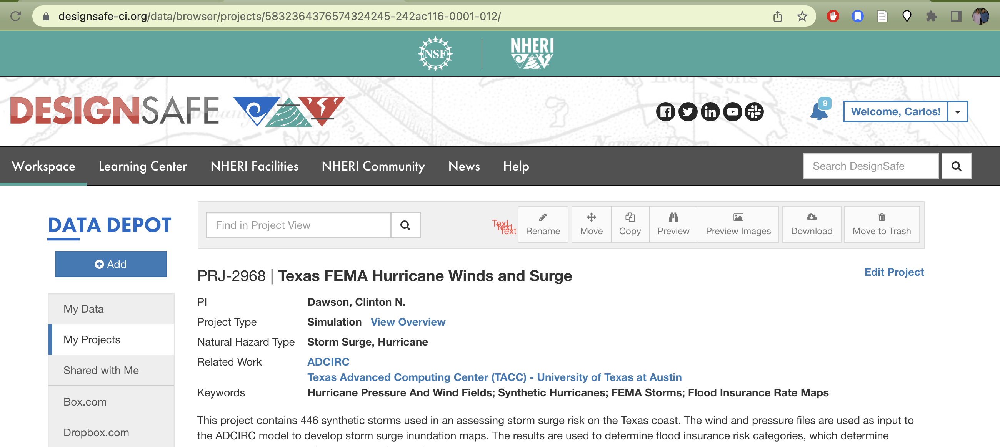
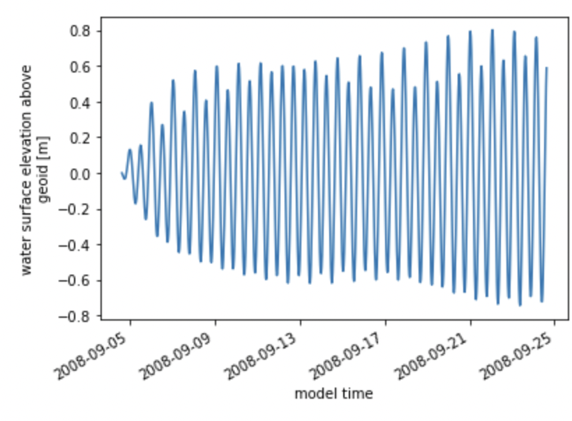
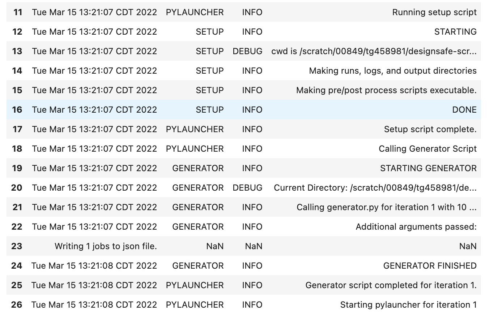
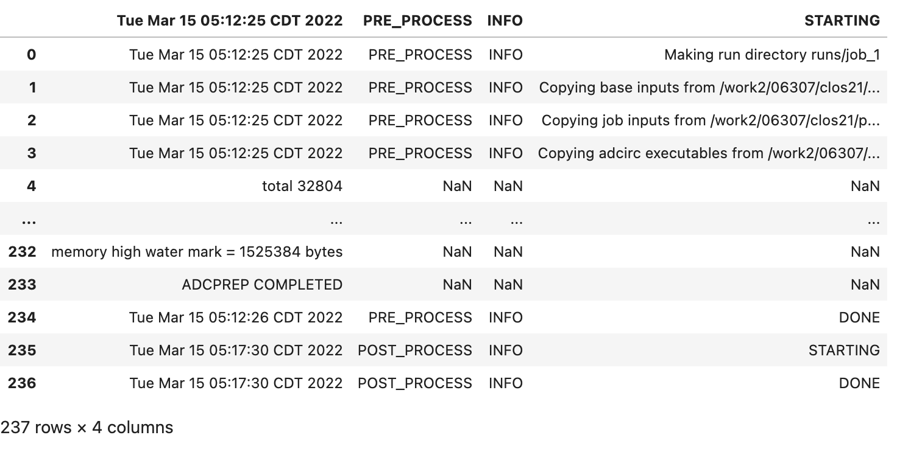

# ADCIRC Use Case - Using Tapis and Pylauncher for Ensemble Modeling in DesignSafe 

**Clint Dawson, Carlos del-Castillo-Negrete, Benjamin Pachev - University of Texas at Austin** 

The following use case presents an example of how to leverage the Tapis API to run an ensemble of HPC simulations. The specific workflow to be presented consists of running ADCIRC, a storm-surge modeling application available on DesignSafe, using the parametric job launcher pylauncher. All code and examples presented are meant to be be executed from a Jupyter Notebook on the DesignSafe platform and using a DesignSafe account to make Tapis API calls. Accompanying notebooks for this use case can be found in the ADCIRC folder in [Community Data](https://www.designsafe-ci.org/data/browser/public/designsafe.storage.community/Use%20Case%20Products/ADCIRC).   The example makes use of the following DesignSafe resources:

[ADCIRC](https://www.designsafe-ci.org/rw/workspace/#!/ADCIRC::Simulation)<br/>
[Jupyter notebooks on DS Juypterhub](https://www.designsafe-ci.org/rw/workspace/#!/Jupyter::Analysis)<br/>


## Background

### Citation and Licensing

* Please cite [Dawson et al. (2021)](https://doi.org/10.17603/ds2-68a9-0s64) if using any of the Texas FEMA Hurricane data used in the examples below. 

* Please cite [Rathje et al. (2017)](https://doi.org/10.1061/(ASCE)NH.1527-6996.0000246) to acknowledge the use of DesignSafe resources.  

* This software is distributed under the [GNU General Public License](https://www.gnu.org/licenses/gpl-3.0.html).  

### ADCIRC

For more information on running ADCIRC and documentation, see the following links:

* [ADCIRC Wiki](https://wiki.adcirc.org/wiki/Main_Page)
* [ADCIRC Web Page](https://adcirc.org/)

ADCIRC is available as a standalone app accesible via the [DesignSafe front-end](https://www.designsafe-ci.org/rw/workspace/#!/ADCIRC::Simulation).

ADCIRC files used in this demo are pre-staged on TACC resources that DesignSafe execution systems have access to, at the path `/work/06307/clos21/pub/adcirc`. See the section on using data from Projects directory for using other data sources.

### Tapis

Tapis is the main API to control and access HPC resources with. For more resources and tutorials on how to use Tapis, see the following:

- [Tapis CLI](https://tapis-cli.readthedocs.io/en/latest/contents.html)
* [AgavePy](https://tacc-cloud.readthedocs.io/projects/agave/en/latest/)
* [DesignSafe Webinar](https://www.youtube.com/watch?v=-_1lNWW8CAg&t=1854s&ab_channel=NHERIDesignSafe-CIMedia)

To initialize tapis in our jupyter notebook we use AgavePy. Relies on `tapis auth init --interactive` being run from CLI first.


> Initialize Tapis from within a shell in a jupyter session. A shell can be launched by going to File -> New -> Terminal.

```python
from agavepy.agave import Agave

ag = Agave.restore()
```

### Pylauncher

Pylauncher is a parametric job launcher used for launching a collection of HPC jobs within one HPC job. By specifying a list of jobs to execute in either a CSV or json file, pylauncher manages resources on a given HPC job to execute all the jobs using the given nodes. Inputs for pylauncher look something like (for csv files, per line):

```
num_processes,<pre process command>;<main parallel command>;<post process command>
```

The pre-process and post-process commands are executed in serial, while the main command is executed in parallel using the appropriate number of processes. Note pre and post process commands should do light file management and movement and no computationally intensive tasks.

## Tapis Pylauncher App

The pylauncher app is the main application we will be using to run ensemble simulations. It serves as a wrapper around the [TACC pylauncher](https://github.com/TACC/pylauncher) utility. 

Check out the application from the github page - [https://github.com/UT-CHG/tapis-pylauncher](https://github.com/UT-CHG/tapis-pylauncher) and deploy it using either the Tapis CLI or AgavePy (See documentation links above under Tapis section), or email cdelcastillo21@gmail.com for access to an already deployed version of the application (it is not a public application yet, so has to be shared explicitly with users).

Overview of this section:

* App Overview
* Staging Files
* Simple ADCIRC RUN
  * Configuring
  * Submitting and Monitoring
  * Getting and visualizing output
* Ensemble ADCIRC Run

### Basic Application Overview

The tapis-pylauncher application loops through iterations of calling pylauncher utility, using as input a file generated by a user defined generator shell script `generator.sh`. An excerpt of this main execution loop is as follows:

```bash
# Main Execution Loop:
#   - Call generator script.
#   - Calls pylauncher on generated input file. Expected name = jobs_list.csv
#   - Repeats until generator script returns no input file for pylauncher.
ITER=1
while :
do
  if [ -e generator.sh ]
  then
    # Call generator if it exists script
    ./generator.sh ${ITER} $SLURM_NPROCS $generator_args
  fi

  # If input file for pylauncher has been generated, then start pylauncher
  if [ -e ${pylauncher_input} ]
  then
    python3 launch.py ${pylauncher_input} >> pylauncher.log
  fi

  ITER=$(( $ITER + 1 ))
done
```

Inputs for a pylauncher ensemble run will consist of a zipped file full of the necessary scripts to run configure the pylauncher ensemble run. At a most basic level, this contains a generator shell script `generator.sh`, that is run on each iteration of the, and if not then just a pylauncher input file that will be run on just once. 


### Staging Files 

For large scale ensemble simulations, it is best to stage files in a project directory that execution systems can access before-hand so that Tapis itself isn't doing the moving and staging of data. 

The corresponding TACC base path to your project with a particular id can be found at `/corral-repl/projects/NHERI/projects/[id]/`. To find the ID for your project, you can just look at the URL of your project directory in designsafe:



> TX FEMA storms project directory. Note how the URL on top contains the Project ID corresponding to the path on corral that execution systems on tapis can access.


### Simple ADCIRC run using Tapis

This section will contain info about how to run a simple ADCIRC run using the pylauncher app. This example has an accompanying notebook in the [ADCIRC Use Case folder](https://www.designsafe-ci.org/data/browser/public/designsafe.storage.community/Use%20Case%20Products/ADCIRC) in the Community Data directory, called ADCIRC-Simple

We will run ADCIRC on the [Shinnecock Inlet Test Grid](https://adcirc.org/home/documentation/example-problems/shinnecock-inlet-ny-with-tidal-forcing-example/).


> Shinnecock Inlet Test Grid. ADCIRC solves the Shallow Water Equations over a Triangular Mesh, depicted above. On the right we see one of the stations, station 2, we will be analyzing output for.

#### Staging Inputs

Input directory contains the following files for running

* setup.sh - Setup script to run before running any ensemble jobs. Sets up runs and logs directory, which is redundant in this case since we are only running a singular run.
* generator.sh - Generator entry point script. Calls the python function.
* generator.py - Python generator function with a basic generator for configuring an ensemble of ADCIRC runs.
* post_process.sh - Script to run per-job to set-up each ADCIRC run using adcprep.
* pre_process.sh - Script to run per-job after each ADCIRC run to move outputs and logs to appropriate directories and cleanup.

The generator script for our case doe

Note we have to first zip up the containing directory since the application expects a zipped input:

```python
job_configs = Path.cwd() / 'job_configs'
adcirc_job_dir = job_configs / 'adcirc' 
input_zip = job_configs / 'adcirc.zip'
input_zip.unlink(missing_ok=True)
os.system(f"zip -r {str(input_zip)} {str(adcirc_job_dir)}")
input_zip
```


#### Configuring and Submitting Job

The python job configuration looks like:

```python
user = 'clos21'
configs_uri = f'agave://designsafe.storage.default/{user}/' + str(job_configs.relative_to('/home/jupyter/MyData'))
base_dir = '/work2/06307/clos21/pub/adcirc/inputs/ShinnecockInlet/nodal/GD-WindMult_WindJan2018_CFSv2_12'
runs_dir = base_dir
execs_dir = '/work2/06307/clos21/pub/adcirc/execs/stampede2/v55_nodal_beta'
cores_per_job = 8
write_proc_per_job = 0
generator_args = f"{base_dir}  {execs_dir}"
generator_args += f" --cores_per_job {cores_per_job} --write_proc_per_job {write_proc_per_job}"


adcirc_config = {}
adcirc_config['name'] = 'adcirc_simple'
adcirc_config['appId'] =  'pylauncher-test-0.0.1'
adcirc_config['nodeCount'] = 1
adcirc_config['processorsPerNode'] =  10
adcirc_config['memoryPerNode'] = '1'
adcirc_config['maxRunTime'] = '00:30:00'
adcirc_config['archive'] = True
adcirc_config['archiveOnAppError'] = True
adcirc_config['inputs'] = {'job_inputs': configs_uri + '/adcirc.zip'}
adcirc_config['parameters'] = {'pylauncher_input': 'jobs_list.json',
                               'generator_args': generator_args}


job = ag.jobs.submit(body=adcirc_config)
```

Note that the `base_dir` and `execs_dir` are paths on TACC systems that should be shared with everyone so that Tapis executions systems have access to them. Furthermore note how the `job_inputs` is the path to the inputs zip file on Tapis systems, which has to be preceded by an agave URI that Tapis uses to locate the file, `configs_uri`. We specify the default storage system, and under your particular 

#### Monitoring Job 

We can get our jobs status by using the `getStatus` command. 

```python
ag.jobs.getStatus(jobId=job['id'])
```

Note we must wait for it to reach a `FINISHED` state, after archiving, to download outputs.


```python
{'id': 'e64c31e9-598e-4c52-9e29-5d36292fa1a3-007',
 'status': 'FINISHED',
 '_links': {'self': {'href': 'https://agave.designsafe-ci.org/jobs/v2/e64c31e9-598e-4c52-9e29-5d36292fa1a3-007'}}}
```

But we can look at the job directory files as they execute to monitor how the job is doing. For example, we can look at the runs directory to see what runs have been started:

```python
[f for f in ag.jobs.listOutputs(filePath='runs', jobId=job['id'])]
```

We should see a list of dictionaries such as:

```python
[{'name': 'job_1',
  'path': 'runs/job_1',
  'lastModified': datetime.datetime(2022, 3, 15, 18, 54, 50, tzinfo=tzlocal()),
  'length': 4096,
  'owner': '?',
  'permission': 'READ_WRITE',
  'mimeType': 'text/directory',
  'format': 'folder',
  'type': 'dir',
  '_links': {'self': {'href': 'https://agave.designsafe-ci.org/jobs/v2/12a21b19-4b5b-4fbc-bc0a-dc25b0d7367f-007/outputs/media/runs/job_1'},
   'system': {'href': 'https://agave.designsafe-ci.org/systems/v2/designsafe.storage.default'},
   'parent': {'href': 'https://agave.designsafe-ci.org/jobs/v2/12a21b19-4b5b-4fbc-bc0a-dc25b0d7367f-007'}}}]
```

#### Getting Job Output

Once the job reaches the archived state, we can see the archive path of the job, which should be accessible from our notebook.

```pyhton
job = ag.jobs.get(jobId=job['id'])
job_archive_path = Path(prefix) / Path(job['archivePath']).relative_to('clos21')
```

For interacting with ADCIRC output data we will primarily use the xarray library:

```python
import xarray as xa

f61 = xa.load_dataset(job_archive_path / 'outputs' / 'job_1.61.nc')
f61
```

We should see an xarray structure looking something like:


> Example ADCIRC time-series xarray data-structure

We can quickly plot using xarray's native plotting capabilities:

```python
f61.isel(station=2)['zeta'].plot()
```


> Example ADCIRC time-series output, this example contains tide only forcing, so we see a pretty basic periodic signal.

#### Analyzing Logs

Logs for the main pylauncher thread that manages all the jobs can be found in the root directory of the job, ending in `.out`. It has a nice structure that can be loaded and read by by the pandas library to analyze logs and see how your job is doing:

```
log_file = [f.name for f in (job_archive_path).iterdir() if f.name.endswith('out')][0]
log = pd.read_csv(job_archive_path / log_file, delimiter='|')
log
```

> Example Log file for full simulation run.

Log files for each job are stored in the `logs/` directory of any job, and are saved per job. They can also be loaded conveniently using pandas:

```python
log_path = job_archive_path / 'logs/job_1_GD-WindMult_WindJan2018_CFSv2_12.log'

log = pd.read_csv(log_path, delimiter='|')
log
```

We should see a pandas data-frame with something like:


> Example Log file for an individual simulation.

## Ensemble of ADCIRC Runs

In this section we will review how to execute an ensemble run of a larger set of files. 

We will use as a model data set the [Texas FEMA Synthetic Storm Data Set](https://www.designsafe-ci.org/data/browser/projects/5832364376574324245-242ac116-0001-012/)

### Configuring Job

Our configuration looks similar to before, except note how the path to our base and execs directories point to the project directory for our Texas FEMA storm data:

```python
user = 'clos21'
configs_uri = f'agave://designsafe.storage.default/{user}/' + str(job_configs.relative_to('/home/jupyter/MyData'))
base_dir = '/corral-repl/projects/NHERI/projects/5832364376574324245-242ac116-0001-012/mesh'
runs_dir = '/corral-repl/projects/NHERI/projects/5832364376574324245-242ac116-0001-012/winds'
execs_dir = '/corral-repl/projects/NHERI/projects/5832364376574324245-242ac116-0001-012/execs/55.00/stampede2'
cores_per_job = 8
write_proc_per_job = 0
generator_args = f"{base_dir}  {execs_dir}"
generator_args += f" --cores_per_job {cores_per_job} --write_proc_per_job {write_proc_per_job}"
generator_args += f" --job_idxs 0,1,2,3,4"


adcirc_config = {}
adcirc_config['name'] = 'adcirc_ensemble'
adcirc_config['appId'] =  'pylauncher-test-0.0.1'
adcirc_config['nodeCount'] = 10
adcirc_config['processorsPerNode'] =  30
adcirc_config['memoryPerNode'] = '1'
adcirc_config['maxRunTime'] = '05:00:00'
adcirc_config['archive'] = True
adcirc_config['archiveOnAppError'] = True
adcirc_config['inputs'] = {'job_inputs': configs_uri + '/adcirc.zip'}
adcirc_config['parameters'] = {'pylauncher_input': 'jobs_list.json',
                               'generator_args': generator_args}


job = ag.jobs.submit(body=adcirc_config)
```

Note how the paths point to the corral storage system path of the TX FEMA storms project directory. Furthermore note how we pass in now as well a `job_idxs` value to indicate what subset of the storms we want to execute. It isn't a good idea to try to execute all 500 storms at once, so batching them up into smaller chunks is usually smart.

