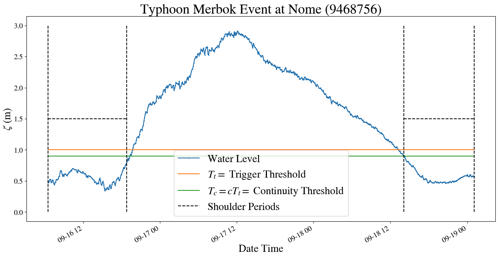
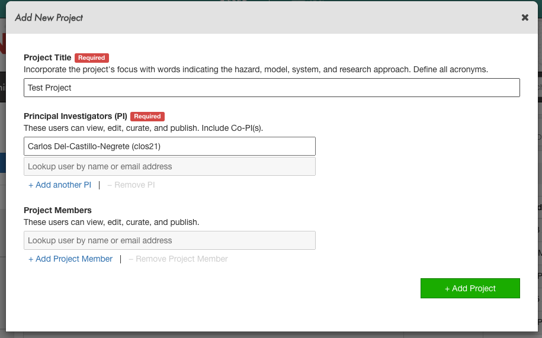
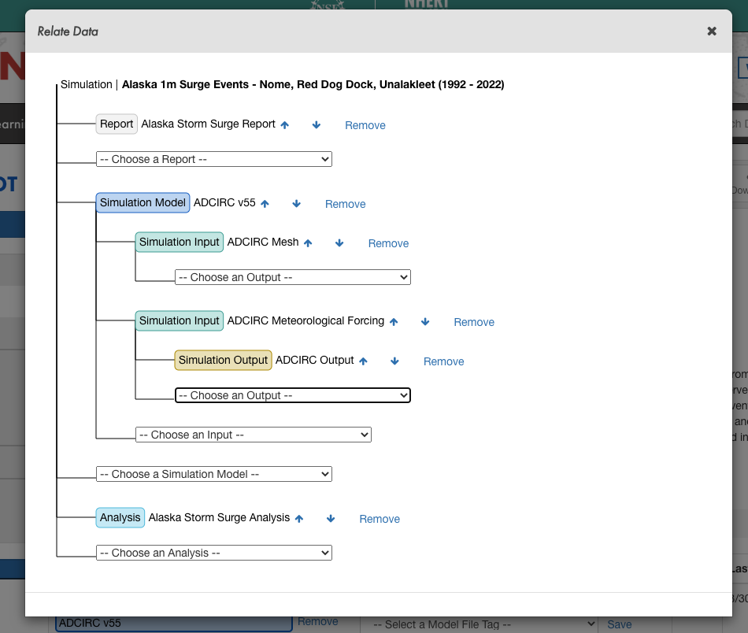

# ADCIRC DataSets

## Creating and Publishing ADCIRC datasets on DesignSafe

**Authors**  
- Clint Dawson, University of Texas at Austin  
- Carlos del-Castillo-Negrete, University of Texas at Austin  
- Benjamin Pachev, University of Texas at Austin

Key Words: ADCIRC, Storm Surge, Hind-casts, Data Curation, Data Publishing

## Resources

- [DesignSafe ADCIRC Application](https://www.designsafe-ci.org/rw/workspace/#!/ADCIRC::Simulation).
- [Jupyter nebooks on DS Juypterhub](https://www.designsafe-ci.org/rw/workspace/#!/Jupyter::Analysis).
- [ADCIRC Wiki](https://wiki.adcirc.org/Main_Page)
- [ADCIRC Web Page](https://adcirc.org/)
- [pyADCIRC GitHub Repository](https://github.com/UT-CHG/pyadcirc) - pyADCIRC documentation.
- [Creating an ADCIRC DataSet.ipynb](https://www.designsafe-ci.org/data/browser/public/designsafe.storage.community/Use%20Case%20Products/ADCIRC)
- [DesignSafe: Running Ensemble Simulations](https://www.designsafe-ci.org/ds-use-case/dawson/usecase/)

## Description

This use case demonstrates the compilation of ADCIRC data-sets of storm-surge hind-casts on DesignSafe.
The workflow includes finding storm-surge events, gathering meteorological forcing, running ADCIRC hind-casts, and organizing and publishing data.
This documentation is designed for applications ranging from Uncertainty Quantification to training Surrogate Models in ADCIRC.

## Implementation

The following use case demonstrates how to compile an ADCIRC data-set of hind-casts on DesignSafe. This workflow involves the following steps:

1. Finding storm-surge events.
2. Compiling meteorological forcing for storm surge events.
3. Running ADCIRC hind-casts using meteorological forcing.
4. Organize and publish data on DesignSafe, obtaining a DOI for your research and for others to cite your data when re-used. 

The workflow presented here is a common one performed for compiling ADCIRC data-sets for a variety of purposes, from Uncertainty Quantification to training Surrogate Models. Whatever your application is of ADCIRC data, publishing your dataset on DesignSafe allows you to re-use your own data, and for others to use and cite your data as well. 

<aside>
💡 Note step 3 will not be covered explicitly in this use-case but rather is covered in the use case on [running ensemble simulations](https://www.designsafe-ci.org/ds-use-case/dawson/usecase/). Refer to that use case for more documentation on how to run ensembles.

</aside>

To see a couple of Example data-sets, and associated published research using the datasets, see the following examples:

- [Texas FEMA Storms](https://www.designsafe-ci.org/data/browser/public/designsafe.storage.published/PRJ-2968) - Synthetic storms for assessing storm surge risk. Used recently in [Pachev et. al 2023](https://arxiv.org/abs/2204.13168) to train a surrogate model for ADCIRC for the coast of Texas.
- [Alaska Storm Surge Events](https://www.designsafe-ci.org/data/browser/public/designsafe.storage.published/PRJ-3887) - Major storm surge events for the coast of Alaska. Also used in [Pachev et. al 2023](https://arxiv.org/abs/2204.13168) for creating a surrogate model for the coast of Alaska.

For a step-by-step guide to executing this use case, refer to the accompanying Jupyter notebook, `Creating an ADCIRC DataSet.ipynb`, found in the ADCIRC folder under [Community Data](https://www.designsafe-ci.org/data/browser/public/designsafe.storage.community/Use%20Case%20Products/ADCIRC).

### ADCIRC Inputs

An ADCIRC run is controlled by a variety of input files that can vary depending on the type of simulation being run. They all follow the naming convention fort.# where the # determines the type of input/output file. For a full list of input files for ADCIRC see the [ADCIRC documentation](https://adcirc.org/home/documentation/users-manual-v50/input-file-descriptions/). At a high level the inputs compose of the following:

- Base Mesh input files - Always present for a run. It will be assumed for the purpose of this UseCase that the user starts from a set of mesh input files.
    - fort.14 - ADCIRC mesh file, defining the domain and bathymetry.
    - fort.15 - ADCIRC control file, containing (most) control parameters for the run. This includes:
        - Solver configurations such as time-step, and duration of simulation.
        - Output configurations, including frequency of output, and nodal locations of output.
        - Tidal forcing - At a minimum, ADCIRC is forced using tidal constituents.
    - Additional control files (there are a lot more, just listing the most common here):
        - fort.13 - Nodal attribute file
        - fort.19, 20 - Additional boundary condition files.
- Meteorological forcing files - Wind, pressure, ice coverage, and other forcing data for ADCIRC that define a particular storm surge event.
    - fort.22 - Met. forcing control file.
    - fort.221, fort.222, fort.225, fort.22* - Wind, pressure, ice coverage (respective), and other forcing files.

**The focus of this use case is to compile sets of storm surge events, each comprising different sets of forcing files, for a region of interest defined by a set of mesh control files.**

### PyADCIRC

The following use case uses the [pyADCIRC python library](https://github.com/UT-CHG/pyadcirc) to manage ADCIRC input files and get data from the data sources mentioned above. The library can be installed using pip:

```bash
$ pip install pyadcirc
```

The `pyadcirc.data` contains functions to access two data sources in particular. First is [NOAAs tidal gauge data](https://tidesandcurrents.noaa.gov/) for identifying storm surge. They provide a [public API](https://api.tidesandcurrents.noaa.gov/api/prod/) for accessing their data, for which pyADCIRC provides a python function and CLI (command line interface) wrapper around. The tidal signal at areas of interest over our domain will allow us to both identify potential storm surge events, and verify ADCIRC hind-casts with the real observations. 


NOAA API CLI provided by the pyadcirc library. The `noaa_data` executable end point is created whenever pyadcirc is installed as library in an environment, providing a convenient CLI for interacting with the NOAA API that is well documented.

The second data source is [NCAR’s CFSv1/v2 data sets](https://api.tidesandcurrents.noaa.gov/api/prod/) for retrieving meteorological forcing files for identify storm surge events. An NCAR account is required for accessing this dataset. Make sure to go to NCAR's website to request an account for their data. You'll need your login information for pulling data from their repositories. Once your account is set-up, you'll want to store your credentials in a json file in the same directory as this notebook, with the name `.ncar.json`.
For example the file may look like:

```json
{"email": "user@gmail.com", "pw": "pass12345"}
```

### Identifying storm surge events

The first stage of the notebook involves using the NOAA API wrapper provided by pyADCIRC to find storm surge events by looking at tidal gauge data in a region of interest. An example of an identified storm surge event, corresponding to Typhoon Merbok that hit the coast of Alaska in September 2022, is shown below.



Result of identification algorithm for the range of dates containing Typhoon Merbok. The algorithm operates by defining a trigger threshold, along with other heuristics, by which to group distinct groups of storm surge events.

The algorithm presented is run on the storms that see the most frequent storm-surge activity over the coast of Alaska, Nome, Red Dog Dock, and Unalakleet. All events are compiled to give date ranges of storm surge events to produce ADCIRC hind-casts for. 

### Getting data forcing data

Having identified dates of interest, the notebook then uses the `ncar` library endpoint to pull meteorological forcing for the identified potential storm surge events. These are then merged with ADCIRC base input files (available at the published data set), to create input runs for an ensemble of ADCIRC simulations, as covered in the use case documentation on [running ADCIRC ensembles in DesignSafe](https://www.designsafe-ci.org/ds-use-case/dawson/usecase/).

### Organizing Data for publishing

Having a set of simulated ADCIRC hind-casts for one or more events, along with any additional analysis performed on the hind-cast data, the true power of DesignSafe as a platform can be realized by publishing your data. Publishing your data allows you and other researchers to reference its usage with a DOI. For ADCIRC, this is increasingly useful as more Machine Learning models are being built using ADCIRC simulation data.

This section will cover how to organize and publish an ADCIRC hind-cast dataset as created above. Note this dataset presented in this use case is a subset of the Alaska Storm Surge Data set that has been published, so please refrain from re-publishing data. 

The steps for publishing ADCIRC data will be as follows

1. Create a project directory in the [DesignSafe data repository](https://www.designsafe-ci.org/data/browser/).
2. Organize ADCIRC data and copy to project directory.
3. Curate data by labeling and associating data appropriately.

While DesignSafe has a whole [guide](https://www.designsafe-ci.org/rw/user-guides/data-curation-publication/) on how to curate and publish data, we note that the brief documentation below gives guidance on how to apply these curation guidelines to the particular case of ADCIRC simulation data. 

### Setting up Project Directory

First you’ll want to create a new project directory in the [DesignSafe data repository](https://www.designsafe-ci.org/data/browser/).



Creating a new project in DesignSafe’s Data Depot.

Next we want to move ADCIRC inputs/outputs from your Jupyter instance where they were created into this project directory. We note that you must first restart your server if your moving data to a project directory that didn’t exist at the time from your server started, as that project directory won’t be in your `~/projects` directory. Furthermore you’ll want to organize your folder structure in the command line before moving it to the project directory. See below for the recommended folder structure and associated data curation labels for publishing ADCIRC datasets. 

```bash
.
├── Report.pdf -> Label as Report - PDF summarizing DataSet
├── mesh -> Label as Simulation Input (ADCIRC Mesh Type)
│   ├── fort.13
│   ├── fort.14
│   ├── fort.15
│   ├── fort.22
│   ├── fort.24
│   └── fort.25
├── inputs -> Label as Simulation Input (ADCIRC Meteorological Type)
│   ├── event000
│   │   ├── fort.15
│   │   ├── fort.221
│   │   ├── fort.222
│   │   └── fort.225
│   └── event001
│       ├── fort.15
│       ├── fort.221
│       ├── fort.222
│       └── fort.225
└── outputs -> Label as Simulation Output (ADCIRC Output)
    ├── event000
    │   ├── fort.61.nc
    │   ├── ...
    │   ├── maxele.63.nc
    │   ├── maxrs.63.nc
    │   ├── maxvel.63.nc
    │   ├── maxwvel.63.nc
    │   └── minpr.63.nc
    └── event001
        ├── fort.61.nc
        ├── ...
        ├── maxele.63.nc
        ├── maxrs.63.nc
        ├── maxvel.63.nc
        ├── maxwvel.63.nc
        └── minpr.63.nc
└── Analysis ->  Label as Analysis  any notebooks/code/images.
    ├── OverviewNotebook.ipynb - Analysis over all events.
    ├── event000
    │   ├── ExampleNotebook.ipynb - Event specific analysis.
    │   ├── ...
```



Example data relation diagram or an ADCIRC Simulation DataSet

## Citations and Licensing

- Please cite 
- Please cite [Rathje et al. (2017)](https://doi.org/10.1061/(ASCE)NH.1527-6996.0000246) to acknowledge the use of DesignSafe resources.
- This software is distributed under the [GNU General Public License](https://www.gnu.org/licenses/gpl-3.0.html).
