# Using Taggit to Browse and Tag Image Files on DesignSafe

**Fred L. Haan, Jr, Calvin University**  

Taggit allows users to easily browse images files on DesignSafe and tag them for later use in analysis or mapping applications. Taggit connects seamlessly to HazMapper to map image locations. Images can be orgnized into groups and the user can create custom tags for each group. All group and tag information can also be exported as data files to be used in other applications.

This documentation file walks the user through each of the steps required to use Taggit.

### Citation and Licensing

* Please cite [Rathje et al. (2017)](https://doi.org/10.1061/(ASCE)NH.1527-6996.0000246) to acknowledge the use of DesignSafe resources.  

* This software is distributed under the GNU General Public License (https://www.gnu.org/licenses/gpl-3.0.html).  

## Getting Started and Creating a Project 
The collapsed menus icon (shown below) opens the main menu of Taggit and enables creating a project, selecting from existing projects, and opening the file browser. Other options from this menu will be described later. To start a new project select "Create Project" and follow the prompts.

## Loading Image Files

Image files can be loaded into an existing project by selecting "File Browser" from the main menu. The File Browser (shown below) provides access to all parts of DesignSafe including My Data, Community Data, Published Project, and My Projects.

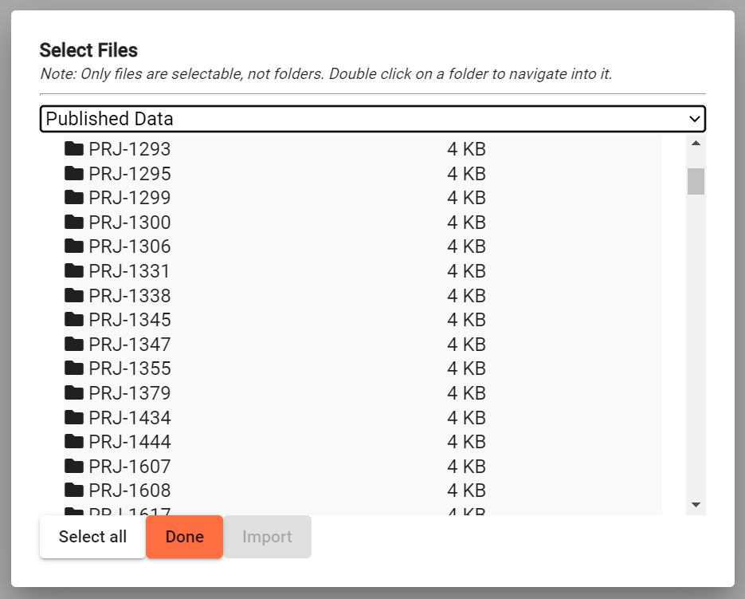

Once you navigate to a folder of interest, you can select files to load into your project by clicking to select, shift-clicking, or using the Select All button.

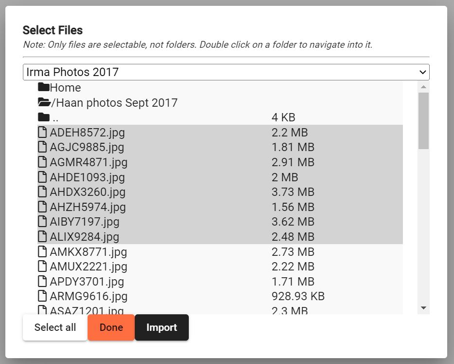

Clicking Import will bring the selected files into your project, and you will see thumbnails of the images as shown below.

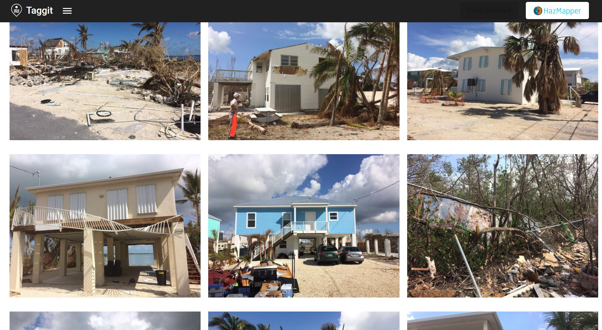

## Creating Groups and Organizing Images

You can start creating groups for your images by clicking on one or more images. A green border will denote selected images, and the Add Group button will appear (see below).

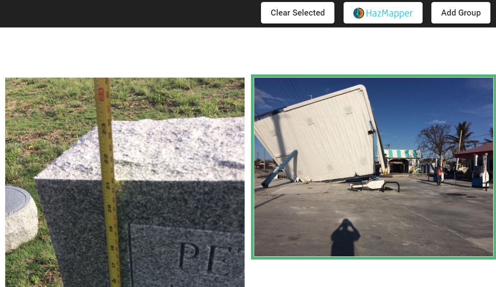

Clicking the add group will bring up a dialog box for you to name the group.

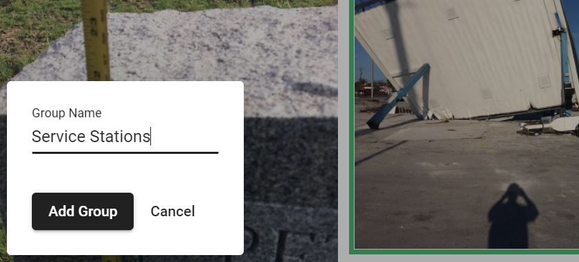

Once you have a group created, the Taggit button will appear (see below). This Taggit button takes you to the Taggit screen where you will see your images in their groups and begin to create tags.

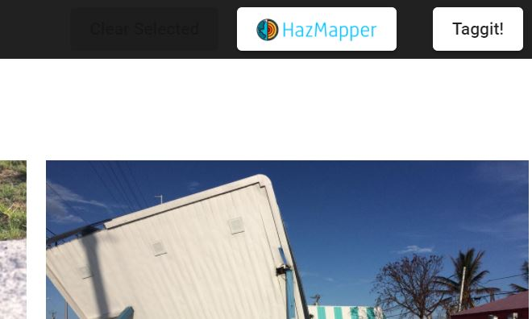

The Taggit screen is shown below. Here you can see the groups that have been created and the images in each group. The Gallery button toggles back to the thumbnail gallery.

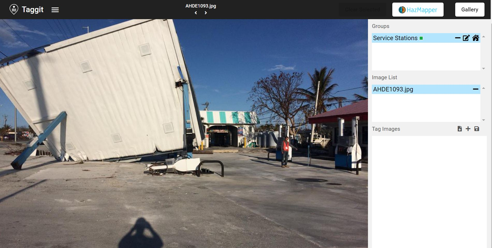

When hovering over any given image in the thumbnail gallery, several icons will appear. The Zoom, Remove, and Add to Group buttons appear in the upper right. The Add To Group button provides another way to add an image to a group. The box in the lower right shows colored boxes representing each group this image belongs to.

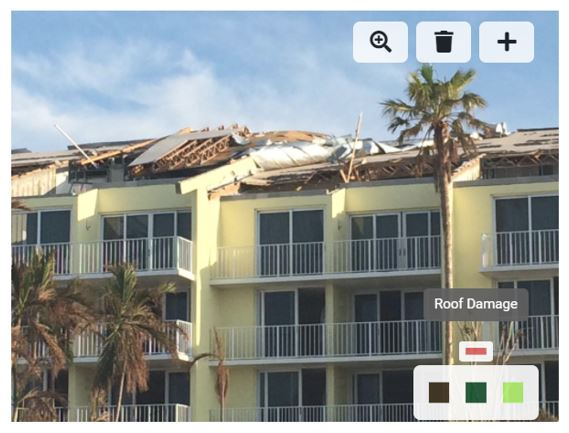

After creating a number of groups and adding images to those groups, your Taggit view will look something like the image below. From this view you can click through the groups and through the images in each group.

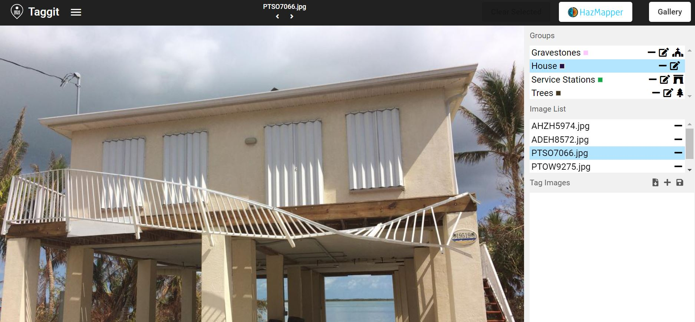

Looking closely at the group list (below) shows that each group has an icon. These icons can be changed by the user simply by clicking on the icon and selecting a different one from the list.

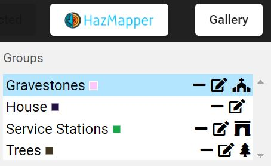

## Creating Tags for Images

On the Taggit screen below the Image List is the Tag Images area (see below). Pressing the "+" icon here allows the user to create custom tags for images. 

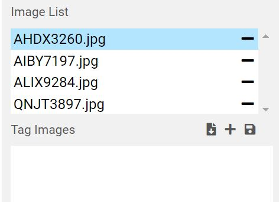

The Create Tag list appears after pressing the "+" button. From this list, the user can select from several different types of tags to create. 

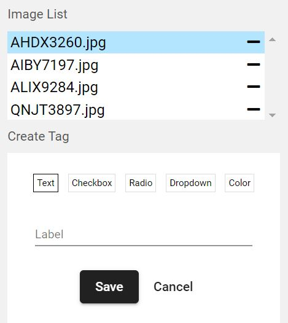

For example, to create a Color Tag, one provides a Label and then adds options with the "+" button (see below).

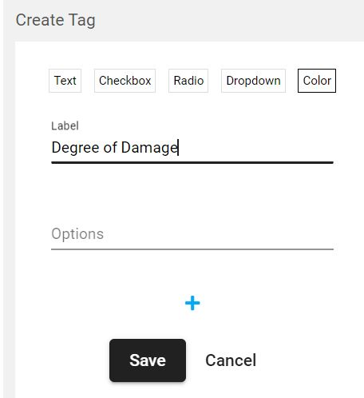

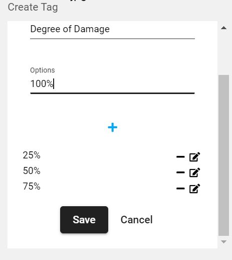

Once all the options have been added, click the Save button to get the final list of tag options. For the Color tag, colors are assigned to each option. These colors will be used if the user decides to map the image using HazMapper.

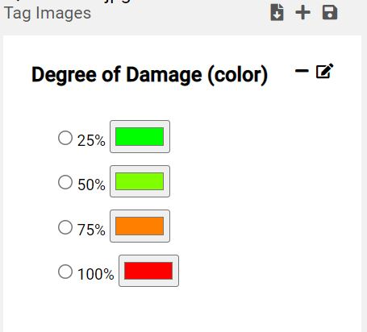

## Plotting Images Locations with HazMapper

A HazMapper button is provided in the upper right part of the screen to allow mapping all the images in a project. Clicking this button will launch HazMapper in its own browser tab.

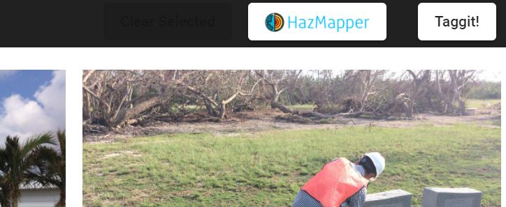

Once HazMapper launches, you will need to click on the Layers button (see below) to add the type of map desired.

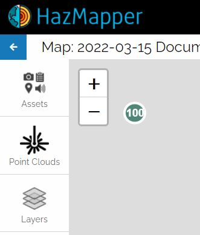

In the window below, one can choose a Roads layer or a Satellite layer.

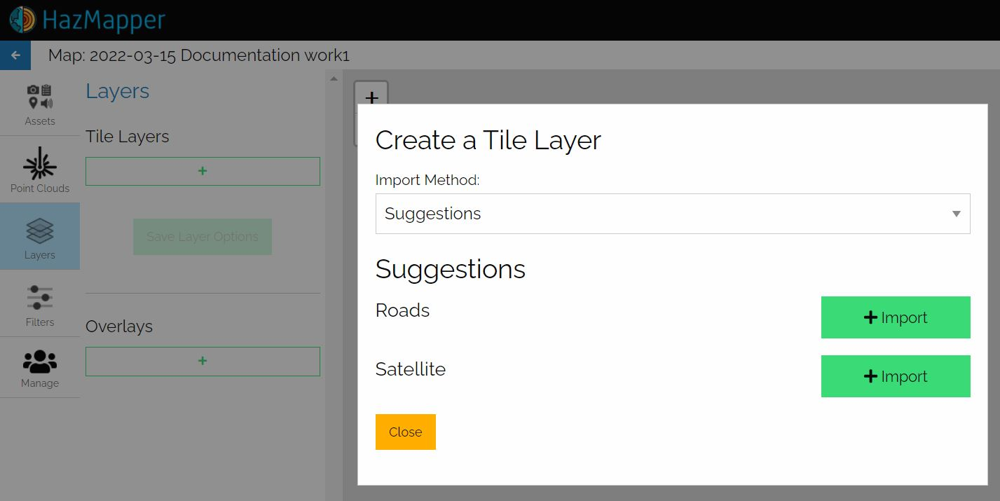

Choosing the Roads layer creates a map like that shown below. The locations of collections of images are denoted with numbers on the map.

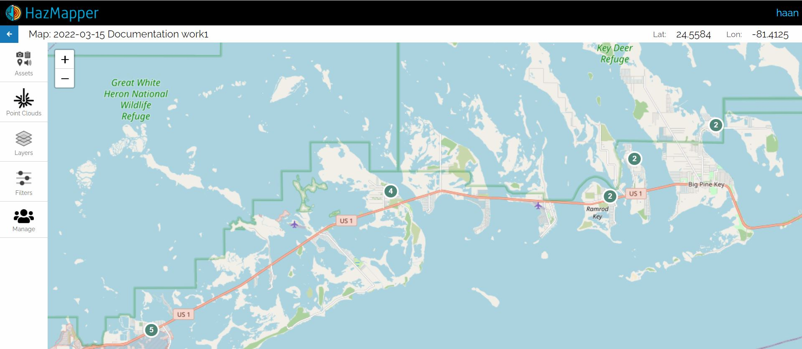

Zooming in to regions where images were taken shows that a generic camera icon or a user-selected icon denotes image location. If a Color tag was assigned to a given image, then that color will be used for the HazMapper icon.

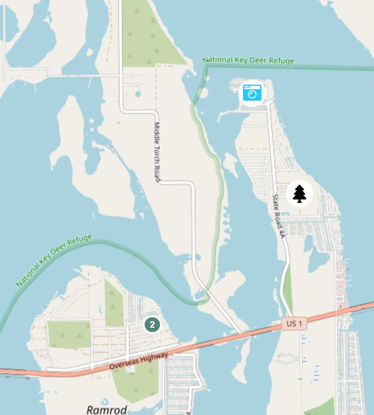

## Exporting Tag Data as CSV Files

From the main menu, the user can select several options (see below) for exporting the group and tag information from the current project. These files can be used for further analysis or for machine learning applications.

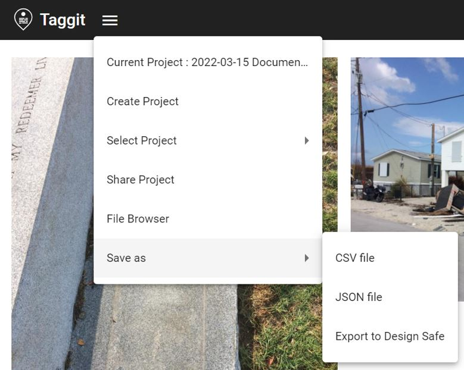

