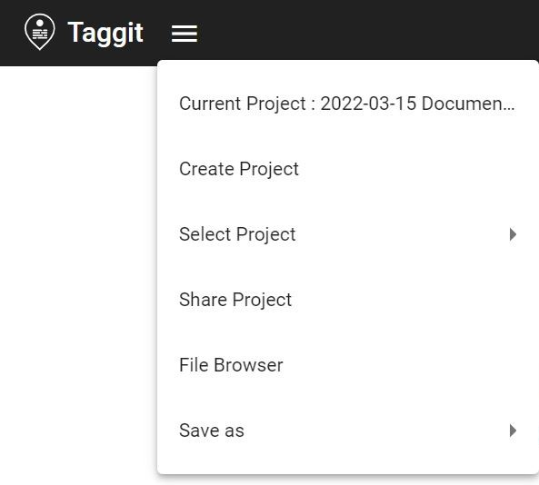

# Using Taggit to Browse and Tag Image Files on DesignSafe

**Fred L. Haan, Jr, Calvin University**  

Taggit allows users to easily browse images files on DesignSafe and tag them for later use in analysis or mapping applications. Taggit connects seamlessly to HazMapper to map image locations. Images can be orgnized into groups and the user can create custom tags for each group. All group and tag information can also be exported as data files to be used in other applications.

This documentation file walks the user through each of the steps required to use Taggit.

### Citation and Licensing

* Please cite [Rathje et al. (2017)](https://doi.org/10.1061/(ASCE)NH.1527-6996.0000246) to acknowledge the use of DesignSafe resources.  

* This software is distributed under the GNU General Public License (https://www.gnu.org/licenses/gpl-3.0.html).  

## Getting Started and Creating a Project 
The collapsed menus icon (shown below) opens the main menu of Taggit and enables creating a project, selecting from existing projects, and opening the file browser. Other options from this menu will be described later. To start a new project select "Create Project" and follow the prompts.

## Loading Image Files

Euismod nisi porta lorem mollis aliquam ut. Tincidunt ornare massa eget egestas purus viverra accumsan in. Varius quam quisque id diam vel. Fermentum odio eu feugiat pretium nibh ipsum consequat nisl. Placerat duis ultricies lacus sed turpis tincidunt id aliquet risus. Condimentum vitae sapien pellentesque habitant morbi tristique senectus et netus. Egestas sed sed risus pretium quam vulputate. Posuere morbi leo urna molestie at elementum. Eget magna fermentum iaculis eu non diam. Nisl tincidunt eget nullam non nisi. Sit amet risus nullam eget felis eget nunc lobortis mattis.

### Header2 Subheading

In aliquam sem fringilla ut morbi. Interdum varius sit amet mattis vulputate enim nulla aliquet. Sit amet mattis vulputate enim nulla.  In egestas erat imperdiet sed euismod nisi porta lorem. Eget nulla facilisi etiam dignissim diam.  Facilisi cras fermentum odio eu feugiat. Velit aliquet sagittis id consectetur. Vel quam elementum pulvinar etiam.  Ut diam quam nulla porttitor massa id neque aliquam. Sodales ut etiam sit amet nisl.  Scelerisque varius morbi enim nunc faucibus a. Sit amet volutpat consequat mauris nunc. Et leo duis ut diam.

*Add images to the folder img and use relative path to specify the location of the image.*   

> Use case template design

## Creating Groups and Organizing Images

Morbi tristique senectus et netus et. Tristique senectus et netus et malesuada fames.  Eu mi bibendum neque egestas congue quisque. Id consectetur purus ut faucibus pulvinar elementum integer enim. Nunc consequat interdum varius sit amet mattis vulputate enim nulla.  Porta nibh venenatis cras sed felis eget. Dui id ornare arcu odio ut sem nulla pharetra diam. Pellentesque habitant morbi tristique senectus et netus et. Commodo nulla facilisi nullam vehicula ipsum a arcu. Nisi porta lorem mollis aliquam ut porttitor leo.

Numbered list 

1. [numbered linked item](https://maps.google.com)
2. second item
3. third item

### Header3 subheading

Ac feugiat sed lectus vestibulum mattis ullamcorper. Et egestas quis ipsum suspendisse ultrices gravida dictum fusce ut. Scelerisque eu ultrices vitae auctor eu augue ut lectus arcu.  Imperdiet proin fermentum leo vel orci porta non pulvinar. Dictumst quisque sagittis purus sit amet. Aliquam purus sit amet luctus. Aliquet bibendum enim facilisis gravida neque convallis a cras. Orci porta non pulvinar neque laoreet suspendisse. Urna neque viverra justo nec ultrices dui.

## Last Taggit Heading

Euismod nisi porta lorem mollis aliquam ut. Tincidunt ornare massa eget egestas purus viverra accumsan in. Varius quam quisque id diam vel. Fermentum odio eu feugiat pretium nibh ipsum consequat nisl. Placerat duis ultricies lacus sed turpis tincidunt id aliquet risus. Condimentum vitae sapien pellentesque habitant morbi tristique senectus et netus. Egestas sed sed risus pretium quam vulputate. Posuere morbi leo urna molestie at elementum. Eget magna fermentum iaculis eu non diam. Nisl tincidunt eget nullam non nisi. Sit amet risus nullam eget felis eget nunc lobortis mattis.

### Header2 Subheading

In aliquam sem fringilla ut morbi. Interdum varius sit amet mattis vulputate enim nulla aliquet. Sit amet mattis vulputate enim nulla.  In egestas erat imperdiet sed euismod nisi porta lorem. Eget nul
