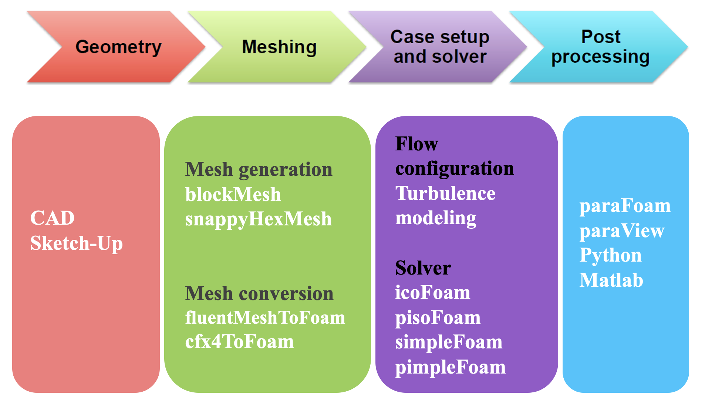
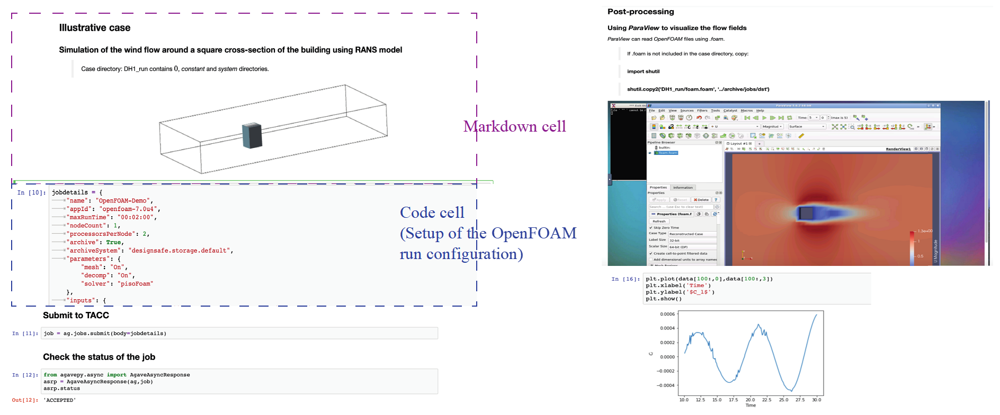
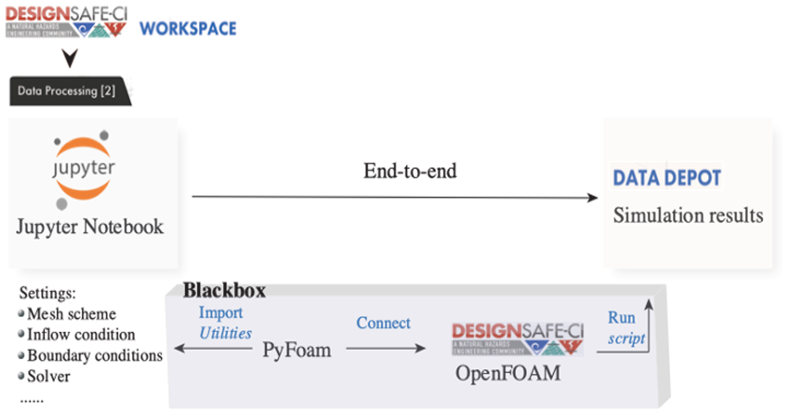
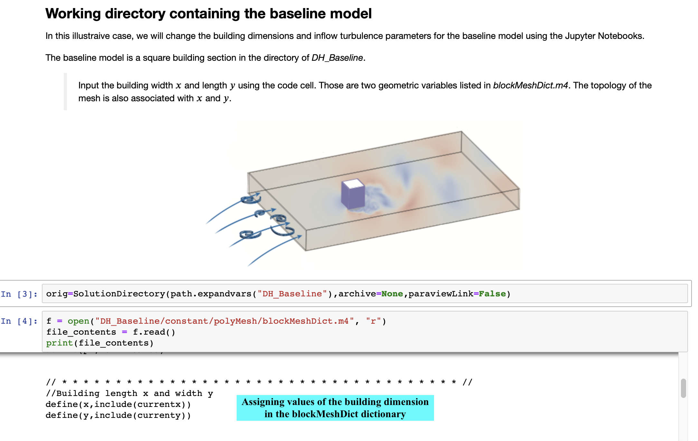

# CFD Simulations using the Jupyter Notebooks
**Fei Ding, Ahsan Kareem, Dae Kun Kwon, and Yan Fang**<br/>
 [NatHaz Modeling Laboratory](https://nathaz.nd.edu/), University of Notre Dame

<br/>

## Description

The Jupyter Notebooks have been widely used in science and engineering communities as an open-source interactive literate programming paradigm. It has the capabilities of combining text, images or videos with research codes, and can easily document, share, and reproduce data analysis. As for CFD, OpenFOAM is popularly used for computationally establishing wind effects on structures. To help beginners overcome the challenges of steep learning curve posed by OpenFOAM and provide users with the capabilities of generating repetitive jobs and advanced functions, this section presents the work to script the workflow for CFD simulations using OpenFOAM in the Jupyter Notebooks. The developed Jupyter Notebooks can aid in determining inflow conditions, creating mesh files for parameterized building geometries and running the selected solvers. This tool can also contribute to the education for CFD learning as online resources, which will be implemented in the [DesignSafe cyberinfrastructure (CI)](https://www.designsafe-ci.org).

### Citation

* Please cite Ding and Kareem (2021) to acknowledge the use of any resources from this use case.<br>
Fei, D., and Kareem, A. (2021). Using the Jupyter Notebooks as a tool for CFD simulations, 6th American Association for Wind Engineering (AAWE) Workshop (online),
Clemson University, Clemson, SC, USA, May 12-14. [PDF](https://tigerprints.clemson.edu/cgi/viewcontent.cgi?article=1025&context=aawe)

<br/>

## Motivation to run CFD analyses in the Jupyter Notebooks

The Jupyter Notebooks has become an attractive venue for data processing, visualization and sharing due to its interactive feature with the code. The Jupyter Notebooks are composed of cells which can be categorized into three types: code, markdown and raw. A code cell can be executed, and a markdown cell contains text or images to illustrate the code. Tools that convert the Jupyter Notebooks into other formats can use raw cells for configuration [1]. As for the output, it can include rich contents such as plots, equations and interactive controls and graphics [2]. The Jupyter Notebooks can be accessed either through a local PC or through a web browser such as on the Jupyter Hub in the Discovery Workspace of DesignSafe CI [3]. This makes it easy to use the same interface running on a remote server [2] to access and manipulate the files.

In the digital age, the burgeoning growth of computational resources to conduct numerical experiments have promoted the use of CFD to assess wind effects on structures. In particular, OpenFOAM has been widely used to solve turbulent flows and other complex fluid flows. However, OpenFOAM as well as commercial CFD software requires the expertise in computational wind engineering, which may hinder their practical use for non-CFD-experts. For example, engineers or researchers lacking the knowledge about the necessary precision regarding the grid resolution could lead to the failure in CFD simulations [4]. Particularly, in modeling the turbulence near the building surface, either wall functions should be appropriately adopted or fine meshes need to be generated because the turbulence quantities such as the wall-normal and wall-parallel stresses decay dramatically near the wall [5]. Otherwise it would result in unrealistic wind pressures on the building surface.

To address this issue in part, Jupyter Notebooks as an open-source project is developed to directly execute the functions for mesh generation, inflow settings, etc. in a user-friendly and interactive coding environment, aiming at alleviating the sophistication in running CFD models in OpenFOAM.

<br/>

## Connecting OpenFOAM with the Jupyter Notebooks
The overall concept of the OpenFOAM workflow may be expressed as physical modeling-discretisation-numerics-solution-visualization as shown in Fig. 1. In the input contexts, three directories named “0”, “Constant” and “System” should be predefined by users, among which “0” contains initial and boundary conditions, “Constant” involves physical properties and turbulence modelling properties, and “System” covers the run-time control and solver numeric [6]. The commonly used solvers for turbulent flows include PisoFoam which is a transient solver for incompressible and turbulent flows and simpleFoam as a steady-state solver. Parallel computations in OpenFOAM allow the simulation to run in the distributed processors simultaneously.


<p align="center">Fig. 1 OpenFOAM workflow for CFD modeling</p>

<br/>

Nonetheless, the OpenFOAM library is written in C++ programming language, and lacks an efficient graphical user interface (GUI). To overcome the challenges of steep learning curve posed by OpenFOAM, Jupyter Notebooks can provide an interpretable and interactive computing environment to run a simulation. An example is provided in this study, which is a URANS simulation for wind flow around a rectangular building's cross-section. As it can be seen from the snapshot of the Jupyter Notebooks in Fig. 2, descriptive texts and figures were included in the markdown cell in order to provide the CFD user with the better understanding about the code. OpenFOAM commands for mesh generation, solver configurations and parallel computing were written in the code cells and executed using the kernel in the Jupyter Notebooks. As parallel computing was required, the simulation was run in the DesignSafe workspace using the Texas Advanced Computing Center (TACC) computing resources. The case was also monitored in the Jupyter Notebooks via checking the job status. Simulation results were stored in the Data Depot in the DesignSafe and available to be post-processed by users.


<p align="center">Fig. 2 Running an OpenFOAM case in the Jupyter Notebooks</p>

<br/>

Regarding post-processing of the CFD simulation, Jupyter Notebooks can be utilized to visualize the flow pattern or analyze the data through its GUI. On the right side of Fig. 2, users can directly launch the parallel visualization software named ParaView GUI in the code cell [7]. As for data analysis such as plotting the drag or lift forces, Python scripts were executed in the code cell, and output figures were generated and can be downloaded. Overall, Jupyter Notebooks is considered as a productive tool for post-processing of flow simulations as well.

<br/>

## Introducing advanced utilities to CFD modeling using PyFoam

Besides the basic utilities that can be called in the Jupyter Notebooks to run an OpenFOAM simulation, Jupyter Notebooks can also facilitate the automated CFD modeling with the aid of the advanced utilities such as parameter variation of the building geometry and the corresponding mesh topology, and manipulating the boundary conditions. To introduce such flexibilities and bring the maximum automation in CFD modeling, an OpenFOAM library named PyFoam [8] is imported to the Jupyter Notebooks. PyFoam is a python library that can manipulate OpenFOAM dictionaries, therefore it can be readily imported to the Jupyter Notebooks to introduced advanced tools for CFD modeling. The schematic is shown in Fig. 3. With the aid of PyFoam, the goal is to achieve an end-to-end simulation in which the Jupyter Notebooks can manipulate dictionaries in OpenFOAM based on the user's input as regular Python dictionaries without looking into the OpenFOAM C++ libraries. In this study, two utilities, which are the automated mesh generation and inflow configuration in the Jupyter Notebooks are explored through the case study of a rectangular building's cross-section.


<p align="center">Fig. 3 Schematic of an end-to-end flow simulation implemented in the Jupyter Notebooks</p>

<br/>

To allow users to edit dimensions of the rectangular building's cross-section, m4-scripting is employed for parameterization in OpenFOAM. To achieve it, case directories of the baseline geometry which is a square cross-section were first copied to the newly created case directories. The controlling points for mesh topology are functions of the input geometric variables. M4-scripting then manipulated the blockMeshDict dictionary, from which values of the controlling points were assigned as shown in Fig. 4. At the end, the blockMeshDict dictionary was built by executing m4-script command as "m4 -P blockMeshDict.m4 > blockMeshDict", then this dictionary was used to generate mesh in OpenFOAM. This technique has been applied to the automated mesh morphing for various building's cross-sectional geometries in our previous research work, where m4-scripting truly brings the automation in creating these repetitive jobs. One limitation in this mesh morphing technique is that it allows for geometric changes within a relatively small range to guarantee the mesh quality since the structured mesh is utilized. To avoid this issue, utilities for unstructured mesh generation in OpenFOAM can be executed instead.


<p align="center">Fig. 4 Use of m4-scripting for automated mesh generation</p>

<br/>

To edit the inflow turbulence properties based on the user's input, PyFoam is employed to set the inflow boundary conditions. In this study, k-ω SST model was selected for turbulence modeling, hence the two inflow turbulence parameters k and ω were modified at different inflow conditions by calling the replaceBoundary [8] utility in the PyFoam. Part of the codes is shown below as

```python
from PyFoam.Execution.UtilityRunner import UtilityRunner
from PyFoam.Execution.BasicRunner import BasicRunner
from PyFoam.RunDictionary.SolutionDirectory import SolutionDirectory
from PyFoam.RunDictionary.SolutionFile import SolutionFile
# change the values k and ω at the inlet
os.chdir(case)
dire=SolutionDirectory(case,archive=None)
sol=SolutionFile(dire.initialDir(),”k”)
sol.replaceBoundary(”inlet”,”%f” %(k))
sol=SolutionFile(dire.initialDir(),”omega”)
sol.replaceBoundary(”inlet”,”%f” %(omega))
```

Overall, a variety of PyFoam utilities can be implemented in the Jupyter Notebooks to bring the convenience and success for CFD users in their CFD modeling using OpenFOAM.

This demonstrates the Jupyter Notebooks developed for scripting the OpenFOAM workflow and allowing parameter variations, which are applied to the wind flow simulation around a building's cross-section. This tool has the promise to overcome the challenges of steep learning curve and lack of GUI posed by OpenFOAM through providing a more user-friendly computing environment and lead to successful CFD simulations. Additionally, this computing tool can be easily shared and reach to broader research communities and engineering groups.

<br/>

## Reference
[1] J. F. Pimentel, L. Murta, V. Braganholo, and J. Freire. A large-scale study about quality and reproducibility of jupyter notebooks. In 2019 IEEE/ACM 16th International Conference on Mining Software Repositories (MSR), pages 507-517. IEEE, 2019.<br>
[2] T. Kluyver, B. Ragan-Kelley, F. Perez, B. E. Granger, M. Bussonnier, J. Frederic, K. Kelley, J. B. Hamrick, J. Grout, S. Corlay, et al. Jupyter Notebooks-a publishing format for reproducible computational workflows., volume 2016. 2016.<br>
[3] Rathje, C. Dawson, J. E. Padgett, J.-P. Pinelli, D. Stanzione, A. Adair, P. Arduino, S. J. Brandenberg, T. Cockerill, C. Dey, et al. Designsafe: New cyberinfrastructure for natural hazards engineering. Natural Hazards Review, 18(3):06017001, 2017.<br>
[4] Y. Tamura and P. Van Phuc. Development of CFD and applications: Monologue by a non-CFD-expert. Journal of Wind Engineering and Industrial Aerodynamics, 144:3-13, 2015.<br>
[5] M. Leschziner. Statistical turbulence modelling for fluid dynamics-demystified: an introductory text for graduate engineering students. World Scientific, 2015.<br>
[6] H. Jasak, A. Jemcov, Z. Tukovic, et al. OpenFOAM: A C++ library for complex physics simulations. In International workshop on coupled methods in numerical dynamics, volume 1000, pages 1-20. IUC Dubrovnik Croatia, 2007.<br>
[7] N. Vuaille. Controlling paraview from jupyter notebook. https://www.kitware.com/paraview-jupyter-notebook/. Online; accessed 24-Feb-2022.<br>
[8] OpenFOAM wiki. Pyfoam. https://openfoamwiki.net/index.php/Contrib/PyFoam. Online; accessed 24-Feb-2022.<br>
