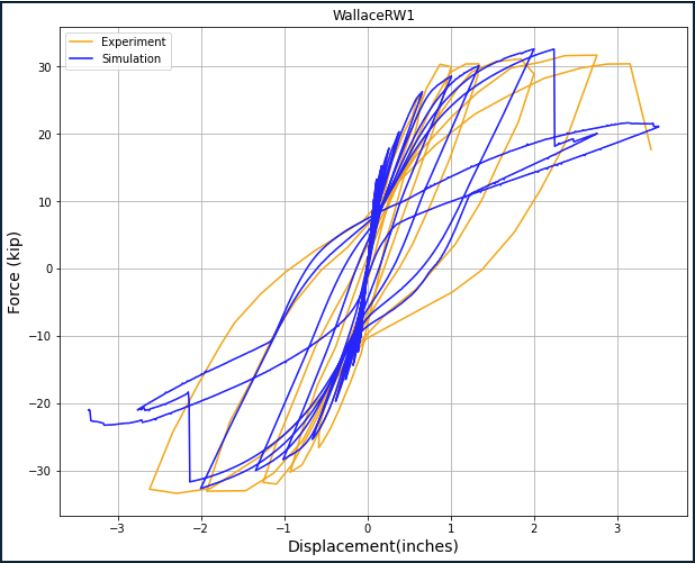

# Modeling Reinforced Concrete Walls with Shell Elements to Simulate Through Opensees and Using Jupyter to Post Process Results

**Josh Stokley and Laura Lowes, University of Washington**  

The purpose of this use case is to be able to model, simulate, and post process multiple reinforced concrete walls at once. This use case uses jupyter notebooks to model these walls with shell elements and uses OpenSeesMP on DesignSafe to simulate the models. The documentation of this use case will use a single wall, RW1, as an example to understand the workflow and objectives of this use case. The following DesignSafe resources are used:  
[Jupyter Notebook on DesignSafe](https://www.designsafe-ci.org/rw/workspace/#!/Jupyter::Analysis)  
[Opensees on DesignSafe](https://www.designsafe-ci.org/rw/workspace/#!/OpenSees::Simulation)  


<!--- test commment --->    
<!--- this is a comment --->  
<!--- this is a comment --->  
<!--- this is a comment --->  
<!--- this is a comment --->  

### Citation and Licensing

* Please cite [Shegay et al. (2021)](https://doi.org/10.17603/ds2-r12q-t415) to acknowledge the use of any data from this use case.

* Please cite [Lu XZ et al. (2015)](http://www.luxinzheng.net/download/OpenSEES/En_THUShell_OpenSEES.htm ) to acknowledge the use of the modeling strategy from this use case.

* Please cite [Rathje et al. (2017)](https://doi.org/10.1061/(ASCE)NH.1527-6996.0000246) to acknowledge the use of DesignSafe resources.  

* This software is distributed under the GNU General Public License (https://www.gnu.org/licenses/gpl-3.0.html).  

## Background  

### Data  

The walls that are modeled are defined in a database provided by Alex Shegay. The database is a MATLAB variable of type 'structure'. The tree-like structure of the variable consists of several levels. Each level consists of several varaiables, each being a 1x142 dimension array. Each entry within the array corresponds to a separate wall specimen. The order of these entries is consistent throughout the database and reflects the order of walls as appearing in the 'UniqueID' array.  

### Modeling

The modeling techniques are inspired by the work of Lu XZ.
The modeling of these walls make use of the MITC4 shell element. This element smears concrete and steel in multiple layers through the thickness of the element. Figure 1 demonstrates this.  Within the shell element, only the transverse steel is smeared with the concrete. The shell elements are modeled to be square or close to square for best accuracy, an assumption that follows this is that cover concrete on the ends of the wall are not taken into account as it would produce skinny elements that would cause the wall to fail prematurely. The vertical steel bars are modeled as trusses up the wall to better simulate the stress of those bars.  The opensees material models that are used are:  

* PlaneStressUserMaterial- Utilizes damage mechanisms and smeared crack model to defin a multi-dimensional concrete model  
    * Variables include: compressive strength, tensile strength, crushing strength, strain at maximum and crushing strengths, ultimate tensile strain, and shear retention factor
    * Model can be found in Lu XZs citation  
 
* Steel02- Uniaxial steel material model with isotropic strain hardening
    * Variables include: yield strength, initial elastic tangent, and strain hardening ratio  
    * Model can be found here: [Steel02 OpenSees](https://opensees.berkeley.edu/wiki/index.php/Steel02_Material_--_Giuffr%C3%A9-Menegotto-Pinto_Model_with_Isotropic_Strain_Hardening)  


Figure 1: Smeared shell element representation  

## Example Description 

RW1 is modeled from the database to produce a tcl file that represents the geometry, material, and simulation history of the wall. The wall is 144 inches high, 47.25 inches long, and 4 inches thick. It consists of 1241 amount of nodes, 1152 amount of shell elements, and 863 amount of steel truss elements. MITC4 shell elements are used to smear the concrete and transverse steel into the thickness while the vertical reinforce bars are modeled as truss elements. RW1 had a compression buckling failure mode in the lab. More information on RW1 and its experimental results can be found here: (RW1 LINK)  
 


The use case workflow involves the following steps:

* Using Jupyter notebook modeling script to create input file for OpenSees
* Running input file through HPC on DesignSafe
* Using Jupyter notebook post processing scripts to evaulate model


## Create Input File using Modeling Script

The jupyter notebook that creates the OpenSees input file can be found here: (LINK TO FILE).

### Reinforced Concrete Wall Database   

Each wall in the database has a number corrosponding to its unique ID. This number will be the single input to the modeling script to create the script. The use case will loop through multiple numbers to create multiple files at once and run them through opensees. Variables are seperated in the database by sections. For example, under the section 'Geometry', one can find the heights of the walls, the thickness of walls, the aspect ratios, and so on. By parsing through these sections, the necassary information can found and imported into the modeling script to build out the wall.

RW1 is wall 34 in the database and using that single number, the modeling script can grab everything that defines RW1.  


### Modeling Script 

The sections of the modeling script are: [Modeling Script](https://jupyter.designsafe-ci.org/user/stokljos/notebooks/MyData/UseCaseScripts/TCL_Script_Creator.ipynb)  
* Section 1: Initializion of the model.  
   * The degrees of freedom and the variables that carry uncertainty are defined.  
* Section 2: Defines nodal locations and elements.  
   * Nodes are placed at the locations of the vertical bars along the length of the wall
   * If the ratio of the length of the wall to the number of elements is too coarse of a mesh, additional nodes are placed inbetween the bars.
   * The height of each element is equal to the length of the nodes in the boundary to create square elements up the wall.
* Section 3: Defines material models and their variables.
   * The crushing energy and fracture energy are calculated and wrote to the .tcl file. The equations for these values come from (Nasser et al.)  Below is the code:
   ```python
   self.gtcc = abs((0.174*(.5)**2-0.0727*.5+0.149)*((self.Walldata[40]*1000*conMult)/1450)**0.7) #tensile energy of confined
   self.gtuc = abs((0.174*(.5)**2-0.0727*.5+0.149)*((self.Walldata[40]*1000)/1450)**0.7) # tensile energy of unconfined
        
   self.gfuc = 2*self.Walldata[40]*6.89476*5.71015 #crushing energy of unconfined
   self.gfcc = 2.2*self.gfuc #crushing energy of confined
   ```  
   * The crushing strain and fracture strain can then be calculated from the energy values
   * The material models are then defined. The concrete material opensees model is:  
   nDMaterial PlaneStressUserMaterial 

* Section 4: Defines the continuum shell model and the thicknesses of transverse steel and concrete.
* Section 5: Defines the elements acrosss the width and height. Also adds vertical truss bars up the height.
* Section 6: Defines constraints
* Section 7: Defines recorders
* Section 8: Defines and applies the gravity load of the wall.
* Section 9: Defines the cyclic anaylsis of the wall.  

The last function of the script is to then run the wall through opensees (This feature can be disabled if the user would like to look at the script before running OpenSees)  


## Running Opensees through HPC

(Script needs to be established on design safe. I have a working notebook, just need to connect it with modeling script)


## Post Processing

After the script is finished running through OpenSees, there are multiple post-processing scripts that can be used to analyize the simulation and compare it to the experimental numbers.

### Load-Displacment Graph

The Load-Displacement script compares the experimental cyclic load history to the simulated cyclic load output. This Script can be found here: [Load Displacement Script](https://jupyter.designsafe-ci.org/user/stokljos/notebooks/MyData/UseCaseScripts/LoadDisplacement.ipynb)  



### Cross Sectional Analysis of Concrete and Steel

The cross sectional script shows stress and strain output across the cross section of the first level for the concrete and steel at various points on the displacement history. This script can be found here: [Cross Section Analysis Script](https://jupyter.designsafe-ci.org/user/stokljos/notebooks/MyData/UseCaseScripts/CrossSectionAnalysis.ipynb)   
  


### Stress and Strain Profile Movies

The Stress/Strain profile movie script utilizes plotly to create an interactive animation of stresses and strains on the wall throughout the load history. The stress animations are vertical stress, shear stress, and maximum and minimum principal stress. The strain animations are vertical strain, shear strain, and maximum and minimum principal strain. This script can be found here: [Stress/Strain Movie Profiles Script](https://jupyter.designsafe-ci.org/user/stokljos/notebooks/MyData/UseCaseScripts/Movies.ipynb)    


### Crack Angle of Quadrature Points

The crack angle script will show at what angle each quadrature point cracks. This script can be found here: [Cracked Points Script](https://jupyter.designsafe-ci.org/user/stokljos/notebooks/MyData/UseCaseScripts/cracked%20model.ipynb)   

