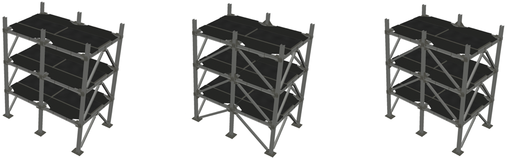
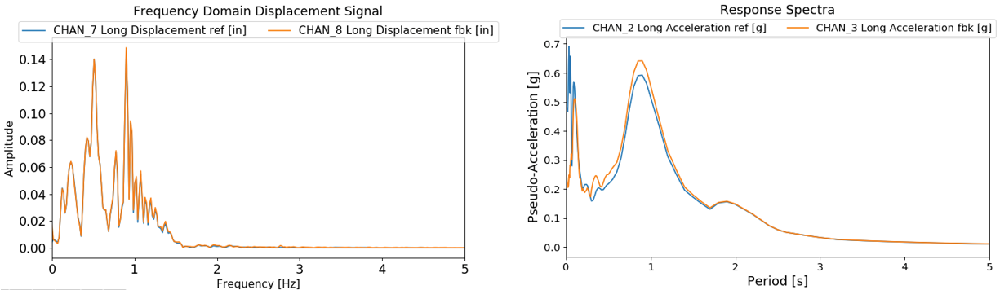
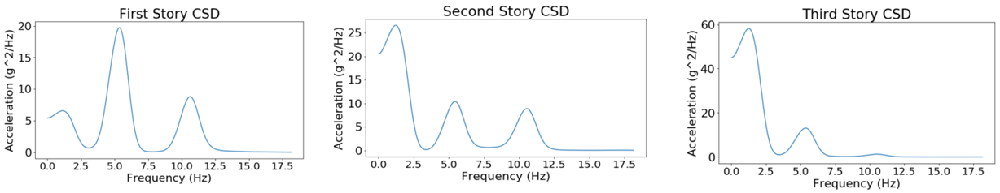
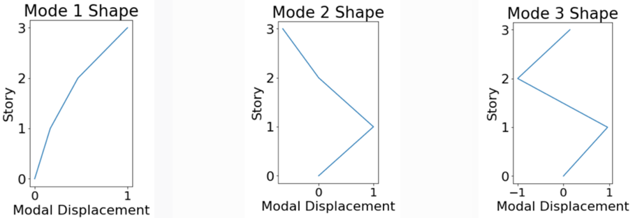

# Integrated Workflow of Experiments using Jupyter Notebooks: From Experimental Design to Publication

**Wendy Miao, Zane Schemmer, Enrique Simbort, Gilberto Mosqueda, University of California, San Diego**  

Jupyter Notebooks can provide fully integrated workflows of experiments from documentation of experimental design through analysis and publishing of data using the DesignSafe cyberinfrastructure. A serires of Notebooks are being developed to demonstrate their use in the experimental workflow including recent testing of a reconfigurable, modular test bed building planned for testing on the NHERI@UC San Diego Experimental Facility. The Python-based code is being implemented in a modular fashion so that components can be used as desired in other experiments and is transferable to other experimental facilities.  The Notebook can be used to evaluate shake table performance as well as dynamic properties of the structure. A key functionality is to increase the integration and collaboration between researchers at local or remote sites to view and analyze the experimental data during and after testing including once the data is published. Additional Notebooks are available using for viewing data from past shake table experiments including NEES and NHERI funded experiments.

## HYBRID SHAKE TABLE FORMULATION 

### Citation and Licensing

* [Brandenberg, S., J., & Yang, Y. (2021)](https://doi.org/10.5281/zenodo.5621169) "ucla_geotech_tools: A set of Python packages developed by the UCLA geotechnical group" (Version 1.0.2) [Computer software].
* Morano M., Liu J., Hutchinson T. C., and Pantelides C.P. (2021), “Design and Analysis of a Modular Test Building for the 6-DOF Large High-Performace Outdoor Shake Table”, 17th World Conference on Earthquake Engineering, Japan.
* [Rathje et al. (2020)](https://doi.org/10.3389/fbuil.2020.547706) “Enhancing research in natural hazard engineering through the DesignSafe cyberinfrastructure”. Frontiers in Built Environment, 6:213.
*  [Van Den Einde et al (2020)](https://doi.org/10.3389/fbuil.2020.580333) “NHERI@ UC San Diego 6-DOF Large High-Performance Outdoor Shake Table Facility.” Frontiers in Built Environment, 6:181.
* Vega et al (2020), “Implementation of real-time hybrid shake table testing using the UCSD large high-performance outdoor shake table”. Int. J. Lifecycle Performance Engineering, Vol. 4, p.80-102.
* [Virtanen et al (2020)](https://doi.org/10.1038/s41592-019-0686-2) “SciPy 1.0: Fundamental Algorithms for Scientific Computing in Python”. Nature Methods, 17, 261–272.
* [Mosqueda et al. (2017)](https://www.buffalo.edu/mceer/catalog.host.html/content/shared/www/mceer/publications/MCEER-13-0003.detail.html) “Seismic Response of Base Isolated Buildings Considering Pounding to Moat Walls”. Technical report MCEER-13-0003.
* [Rathje et al. (2017)](https://doi.org/10.1061/(ASCE)NH.1527-6996.0000246) DesignSafe: New Cyberinfrastructure for Natural Hazards Engineering. ASCE J.Struct. Eng., 
Vol. 18, Issue 3.
* [Vega et al. (2018)](https://doi.org/10.17603/DS2C687) "Five story building with tunned mass damper", in NHERI UCSD Hybrid Simulation Commissioning. DesignSafe-CI.
* Chopra A. K., Dynamics of Structures. Harlow: Pearson Education, 2012. 
* [Masroor et al. (2010)](https://doi.org/10.4231/D3HH6C57D) "Limit State Behavior of Base Isolated Structures: Fixed Base Moment Frame", DesignSafe-CI.
* This software is distributed under the GNU General Public License (https://www.gnu.org/licenses/gpl-3.0.html).

## Introduction

DesignSafe is a component of The Natural Hazard Engineering Research Infrastructure (NHERI). Being a cyberinfrastructure DesignSafe provides a collaborative workspace for cloud-based data analysis, data sharing, curation and publication of curated data. Within this workspace Jupyter Notebooks are applied to perform data analysis in an interactive environment. Since one of the major goals of DesignSafe is spread the capabilities of collaborative workspace by means of data sharing, the main objective of this document is to demonstrate the use of Jupyter Notebook within the experimental workflow.

A series of Jupiter Notebooks aimed to serve as a learning tool is composed of the following routines:
1.	Shake table performance. In which data extraction and data processing of testing results for the case of the first experiment to be conducted following the upgrade to 6DOF of the Large High Performance Shake Table (LHPOST6) at the NHERI@UC San Diego Experimental Facility
2.	Module for Structural Response and System Identification. The system identification of a two-bay by one-bay, 3-story steel building (Modular Testbed Building (MTB2)) is performed.

## Modular Testbed Building
The Modular Testbed Building (MTB2) is designed to be a shared-use, reconfigurable experimental structure. The standard 3-story building can simulate braced frame and moment frame behavior through replaceable fuse type components including buckling restrained braced frames and Durafuse shear plate connections, respectively. The unique connection scheme allows for yielded fuse type members to be easily replaced to restore the structure to its original condition. The MTB2 can be constructed in various configurations with three examples shown in Fig 1. The lateral framing system in the 2-bay direction can be modeled as moment frames or braced frames. The single bay direction has a span of 20 feet and is a braced frame. Each span in the double bay direction is 16 feet. The story height for all floors is 12 feet with columns that extend 4 feet above the top floor.  The Special Moment Frame (SMF) configuration utilizes replaceable shear fuse plates while the braced frame utilizes Buckling-Restrained Braces. 



Figure 1.   MTB2 building: a) SMF configuration (left), b) BRB-1 configuration (center), and c) BRB-2 configuration (right).

## Development of Jupyter Notebooks for Experimental Workflow
Jupyter Notebooks work as an interactive development environment to code and view data in a report format. Within the notebook, the combination of cells enables formatted text and interactive plotting for viewing and analyzing data.  Users can select data files and data channels for viewing and processing. with the ability to view and print complete reports. Jupyter Notebooks are accessible in DesignSafe through the workspace analysis tools and can access private or public data in Data Depot. Sample modules are presented here that have been developed using published data in Data Depot including [4] and [5]. These modules will be configured and applied within the workflow of the MTB2 during shakedown testing.

### [Case 1. Shake table performance](https://www.designsafe-ci.org/data/browser/projects/954727520918105625-242ac11c-0001-012/Jupyter_Notebook_Code_documents/Jupyter_Notebook_Project)
A set of modules have been developed to evaluate the performance of the shake table using data from past experiments conducted to demonstrate the hybrid testing capabilities of LHPOST [6]. For these hybrid tests, separate Jupyter Notebooks have been developed to consider the various sources of generated data including i) Shake Table Controller, ii) the primary Data Acquisition System (DAQ), and iii) additional computational sources for hybrid testing. In a typical shake table test, the first two sources of data would be included plus any other user specified data acquisition system.  
Data collected by the shake table controller is expected to be standard across most tests and useful to verify the performance of the shake table in reproducing the ground motions. Here, data from the shake table controller [4] is used to compare reference command and measured feedback data to evaluate the fidelity of the shake table in reproducing the desired ground motions. The Jupyter notebook functionality includes interactive plotters for viewing either a single channel or multiple channels to compare the reference input and feedback, for example, by viewing the time history, Fourier Transform or Response Spectra (Fig 2). The shake table controller sampling rate was set to a frequency of 2048 [Hz] for this test.  Initial implementation of the code required about 3.5 minutes to run. To improve the run-time, various options were explored including down sampling and use of tools such as those being developed by Brandenberg and Yang [7] to calculate the spectral acceleration. By using these tools, the run time was reduced to approximately 10 s. The module was implemented for the previous 1-D capability of LHPOST but can be easily extended for its newly upgraded 6DOF capabilities.



Figure 2. Evaluation of shake table performance through comparison of command reference and feedback including a) Fourier Transform and b) response spectra .

### [Case 2.Module for Structural Response and System Identification](https://www.designsafe-ci.org/data/browser/projects/954727520918105625-242ac11c-0001-012/Jupyter_Notebook_Code_documents/Jupyter_Notebook_Project)
The primary goal of the structural response module is to quickly and accurately analyze experimental data. As such, this module would be constructed based on draft instrumentation plans for the MTB2. This Data module will plot the primary structural response such as story accelerations and drifts as well as employ system identification routines available in Python.  Current work is exploring use of machine learning libraries for applications to these modules.  For development and testing of these algorithms, test data from a previous dynamic experiment involving a ¼ scale three-story steel moment frame structure were used [5, 8] and demonstrated here. A cross spectral density function (CSD) is applied to compare the white noise acceleration input at the platen to the acceleration at each floor. To improve code clarity and compatibility for future investigators, the CSD function from the SciPy signal package [9] is implemented, which is well documented. The CSD for each floor is plotted using the matplotlib library. The resulting CSD plots are shown up to 20 Hz in Fig. 3 and identify the natural frequencies of the structure. The developed module can be adjusted to accommodate different experimental requirements and will be adopted for the MTB2 experiments.
Modal displacements can also be calculated directly from the CSD function outputs. This is accomplished by using the frequency-power relation between acceleration spectral density functions and displacement spectral density functions [10]. The modal displacements for each story occur at frequencies where the CSD has a local maximum. To obtain these values for the test data of the three-story structure, the frequencies of the first three local maxima were recorded. For future investigators wishing to use this code for smaller or larger versions of the MTB2, the desired number of mode shapes can be scaled by adding or removing local maxima terms at the start of the mode shapes code section. Using the CSD function does not take into account the sign of the modal displacement, however, since these functions are strictly positive over their domain. To account for this, the output of the CSD function at the local maxima frequencies is reexamined without considering the absolute values of its components to identify if the parameters yield a negative number at the corresponding frequency. The rough shape of the modal displacements is plotted as shown in Fig. 4. Future work for this notebook includes generating a smoothing function for the mode shapes and comparison of data from different tests to identify changes in dynamic properties through the testing series that could be indicative of damage.



Figure 3. System identification of three story moment frame [5] subjected to white noise from CSD function outputs.




Figure 4. Mode shapes estimation from 3-story building subjected to white noise on shake table.


## Conclusions
The Jupyter Notebooks developed for use through DesignSafe will facilitate the viewing and analysis of data sharing with collaborators from testing through data publication. A key advantage is the cloud-based approach that facilitates interactive data viewing and analysis in a report format without having to download large datasets. 
The Jupiter Notebook presented here includes routines to evaluate the performance of the shake table and carry out system identification of structural models. Since one major goal of DesignSafe is to develop a collaborative workspace to view, analyze and share data, the implemented Jupiter Notebook represents the first step towards this goal. Here by means of the anlysis of a three degree of freedom system based on test results, a potential user can start learning system identification on a simple structure. Further work for development this Jupiter Notebook includes applications of machine learning based on regression analysis for system identification.

## Annex 1
### [Fragment of System Identification Routine](https://www.designsafe-ci.org/data/browser/projects/954727520918105625-242ac11c-0001-012/Jupyter_Notebook_Code_documents/Jupyter_Notebook_Project)

### Cell 2
``` python
from IPython.utils import io

import numpy as np
import pandas as pd
import linecache
pd.set_option('display.max_rows', None)

#path=fc.selected
path='/home/jupyter/NEES/NEES-2008-0571.groups/Experiment-8/Trial-12/Rep-1/Unprocessed_Data/fbgm152s3.asc'
data_open = open(path) # open data and store data
print(data_open)
data = np.loadtxt(path,skiprows=6,unpack=True) # convert to readable data
n,c = data.shape
print('n=',n)
print('c=',c)
n_channels=len(data)
print(n_channels)
info_head=[]
for i in range(0,n_channels):
    info_head.append("CHAN_"+str(i+1))#create the names of the channels

data1 = pd.read_table(path,delimiter='\s+',nrows=6,skiprows=4,names=info_head)
print(data1)
DESC_CHAN=[]
UNITS_CHAN =[]

for k in range(0,n_channels):
    DESC_CHAN.append((data1.loc[0, info_head[k]]))
    UNITS_CHAN.append((data1.loc[1, info_head[k]]))  
    
tab=pd.DataFrame(list(zip(DESC_CHAN,UNITS_CHAN)), columns = ['Description','Units'])
display(tab)
```
### Description of cell 2

To begin processing data, python libraries will be utilized to form the basis of the module; this includes NumPy, pandas, and linecache. NumPy will take multiple data points about a single variable represented in arrays to compute various forms of numerical representation such as means, standard deviations, variance, and medium. For a graphical representation, pandas will allow users to manipulate datasets with various variables to produce two-dimensional tables and other graphical visualizations - displaying trends amongst the data. As the basis of the python is developed, linecache will allow users to easily search lines and trace back written codes to identify things like syntax errors.

With the basis of the module set up, the data set is now ready to be uploaded into the module. Users can begin by searching and locating the corresponding file with raw data on their local harddrive. Once the file has been located and selected, the program will then work to extract the data and replicate it onto the module. The imported data will then be examined by the module to establish a new system of organization based upon the number of variables and the number of datapoints - establishing dimension and arrays of the data set.

More specifically, the module will first identify the number of elements and its corresponding name in the table. Once the general parameters are set, the module works to transcribe the data from the original file located in the local harddrive - displaying 6 rows and skipping the 4th row. The resulting product will provide users with 2 columns, Description and Units with corresponding data points representing various measurements taken throughout the experiment.

