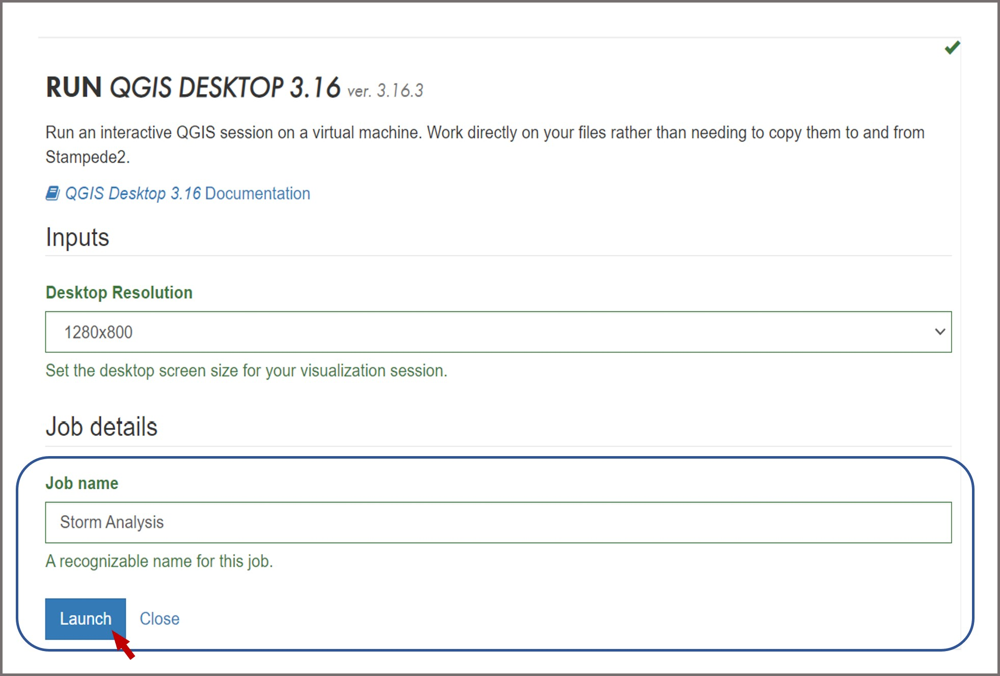

# Integration of QGIS and Python Scripts to Model and Visualize Storm Impacts on Distributed Infrastructure Systems

> **Catalina González-Dueñas and Jamie E. Padgett - Rice University**

> **Miku Fukatsu - Tokyo University of Science**

This use case study shows how to automate the extraction of storm intensity parameters at the structure level to support regional risk assessment studies. This example leverages QGIS and python scripts to obtain the surge elevation and significant wave height from multiple storms at specific building locations. The case study also shows how to visualize the outputs in QGIS and export them as a web map. The followig DesignSafe resources are leveraged in this example: 

[Geospatial data analysis and Visualization on DS - QGIS](https://www.designsafe-ci.org/rw/workspace/#!/qgis-duvd-3.16.3u2)

[Jupyter notebooks on DS Jupyterhub](https://www.designsafe-ci.org/rw/workspace/#!/Jupyter::Analysis)

## Background 

### Citation and Licensing

* Please cite [González-Dueñas and Padgett (2022)](https://doi.org/10.17603/ds2-3zdj-493) to acknowledge the use of any resources from this use case.

* Please cite [Rathje et al. (2017)](https://doi.org/10.1061/(ASCE)NH.1527-6996.0000246) to acknowledge the use of DesignSafe resources.  

* This software is distributed under the GNU General Public License (https://www.gnu.org/licenses/gpl-3.0.html).  

### Description 

This case study aims to support pre-data processing workflows for machine learning applications and regional risk analysis. When developing predictive or surrogate models for the response of distributed infrastructure and structural systems, intensity parameters need to be associated with each component of the system (e.g., buildings, bridges, roads) under varying hazard intensity or different hazard scenarios. To accomplish this and given the different resolutions of the hazard and infrastructure data, geographical tools need to be used to associate the intensity parameters with the distributed infrastructure or portfolio components. In this case study, python codes were developed to automate geospatial analysis and visualization tasks using QGIS. 

This case study is divided into four basic components:

> 1. Introduction and workflow of analysis
> 2. Storm data analysis using Jupyter notebooks
> 3. Geospatial analysis via QGIS
> 4. Visualization of the outputs

## Introduction and worflow of analysis

In this example, the automated procedure to extract intensity parameters is leveraged to obtain the surge elevation and significant wave height at specific house locations for different storm scenarios. The surge elevation and the significant wave height are important parameters when evaluating the structural performance of houses under hurricane loads, and have been used to formulate different building fragility functions (e.g., [Tomiczek, Kennedy, and Rogers (2014)](https://doi.org/10.1061/(ASCE)WW.1943-5460.0000212); [Nofal et al. (2021)](https://doi.org/10.1061/(ASCE)ST.1943-541X.0003144)). As a proof of concept, the intensity parameters (i.e., surge elevation and significant wave height) will be extracted for 3 different storms using the building portfolio of Galveston Island, Texas. The storms correspond to synthetic variations of storm FEMA 33, a probabilistic storm approximately equivalent to a 100-year return period storm in the Houston-Galveston region. The storms are simulated using ADCIC+SWAN numerical models of storm FEMA33, with varying forward storm velocity and sea-level rise. For more details on the storm definition, the user can refer to [Ebad et al. (2020)](https://doi.org/10.3389/fbuil.2020.00104) and [González-Dueñas and Padgett (2021)](https://doi.org/10.3389/fbuil.2021.690715). 

In order to relate the storm data to the building portfolio data, it is necessary to convert the storm outputs to a surface data and then extract at the locations of interest. First, the output files from the ADCIRC+SWAN simulation corresponding to the surge elevation (file fort.63.nc) and significant wave height (file swan_HS.63.nc) need to be converted to a format that can be exported to a GIS (Geographical Information System) software. This pre-processing of the storm data provides the surge elevation and significant wave height in each of the grid points used to define the computational domain of the simulation in a vector data format. Since these points (i.e., ADCIRC+SWAN grid) have a different resolution than the infrastructure system under analysis (i.e., building locations), the storm outputs are converted to a surface data format and then the value at each building location is extracted from it. This is repeated for each one of the storms under analysis and then the ouput data is (IMs at each building location) is exported as a csv file. This file is used to support further analysis in the context of risk assessment or machine learning applications, as predictors or response of a system. The workflow of analysis is as follows:


## Storm data analysis using Jupyter notebooks

To read the ADCIRC+SWAN storm simulation outputs, two Jupyter notebooks are provided, which can extract the maximum surge elevation and significant wave height values within a particular region. The [Read_Surge](https://www.designsafe-ci.org/data/browser/public/designsafe.storage.community/Use%20Case%20Products/QGIS/Read_ADCIRC) Jupyter notebook takes as an input the *fort.63.nc* ADCIRC+SWAN output file and provides a csv file with the surge elevation value at each of the points within the region specified by the user. Specifying a region helps to reduce the computational time and to provide the outputs only on the region of interest for the user. Similarly, the [Read_WaveHS](https://www.designsafe-ci.org/data/browser/public/designsafe.storage.community/Use%20Case%20Products/QGIS/Read_ADCIRC) Jupyter notebook, reads the *swan_HS.63.nc* file and provides the significant wave height in the grid points of the specified area. 

To use the Jupyter notebooks, the user must:

1. Create a new folder in *My data* and copy the Jupyter notebooks from the *Community Data* folder
2. Ensure that the *fort.63.nc* and *swan_HS.63.nc* are located in the same folder as the Jupyer notebooks
3. Change the coordinates of the area of interest in [6]:

``` python
# Example of a polygon that contains Galveston Island, TX (The coordinates can be obtained from Google maps)
polygon = Polygon([(-95.20669, 29.12035), (-95.14008, 29.04294), (-94.67968, 29.35433), (-94.75487, 29.41924), (-95.20669, 29.12035)])
```
4. Modify the name of the output csv file in [8] (if desired):
``` python
# In this example, the output name of the csv surge elevation file is "surge_max"
with open('surge_max.csv','w') as f1:
```
Once the Jupyter notebooks run, two output csv files containing the surge elevation and significant wave height in the area of interest should be generated and saved in your folder. The first two columns of the csv file correspond to the geographical coordinates (i.e., longitud and latitude) of the grid point, and the third one corresponds to the respective intensity measure (surge elevation or significant wave height).

## Geospatial analysis via QGIS

### Opening a QGIS session in DesignSafe

To access QGIS via DesignSafe go to [Workspace -> Tools & Applications -> Visualization -> QGIS Desktop 3.16](https://www.designsafe-ci.org/rw/workspace/#!/qgis-duvd-3.16.3u2). You will be prompted the following window:



Change the desktop resolution according to your screen size preferences, provide a name for your job, and hit *Launch* when you finish. After a couple of minutes your interactive session will start, click *Connect*:


You will be directed to an interactive QGIS session, create a new project by clicking the *New Project* icon or press *Ctrl+N*:


### Modify user inputs and run the python script

## Visualization of the outputs

Morbi tristique senectus et netus et. Tristique senectus et netus et malesuada fames.  Eu mi bibendum neque egestas congue quisque. Id consectetur purus ut faucibus pulvinar elementum integer enim. Nunc consequat interdum varius sit amet mattis vulputate enim nulla.  Porta nibh venenatis cras sed felis eget. Dui id ornare arcu odio ut sem nulla pharetra diam. Pellentesque habitant morbi tristique senectus et netus et. Commodo nulla facilisi nullam vehicula ipsum a arcu. Nisi porta lorem mollis aliquam ut porttitor leo.

Numbered list 

1. [numbered linked item](https://maps.google.com)
2. second item
3. third item


**Example Table**

| Column 1 | Column 2 | Column 3 |
|----------|----------|----------|
| Stampede2| CPU      | 2017     |     
| Frontera | CPU & GPU| 2019     |     

Or use markdown table generator: [https://www.tablesgenerator.com/markdown_tables](https://www.tablesgenerator.com/markdown_tables)


### Math

To generate math equations in markdown.

For inline mode formulas: $`a^2+b^2=c^2`$.

For display mode formulas which appear on a separate line
```math
f(x) = \int_{-\infty}^\infty
\hat f(\xi)\,e^{2 \pi i \xi x}
\,d\xi
```

### Code

``` python
import tensorflow as tf
```

Highlight specific lines of the code

``` python hl_lines="3 4"
""" Bubble sort """
def bubble_sort(items):
    for i in range(len(items)):
        for j in range(len(items) - 1 - i):
            if items[j] > items[j + 1]:
                items[j], items[j + 1] = items[j + 1], items[j]
```
