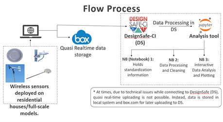
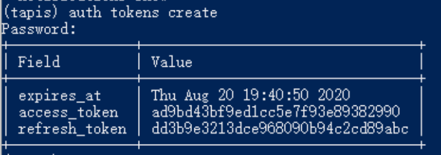
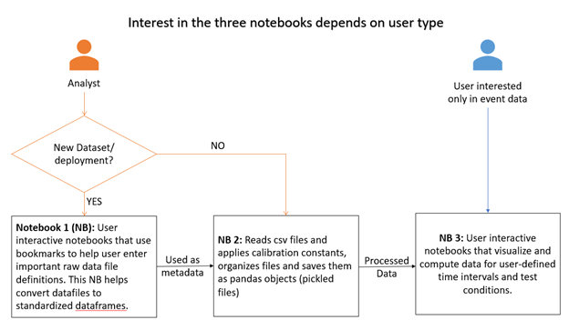
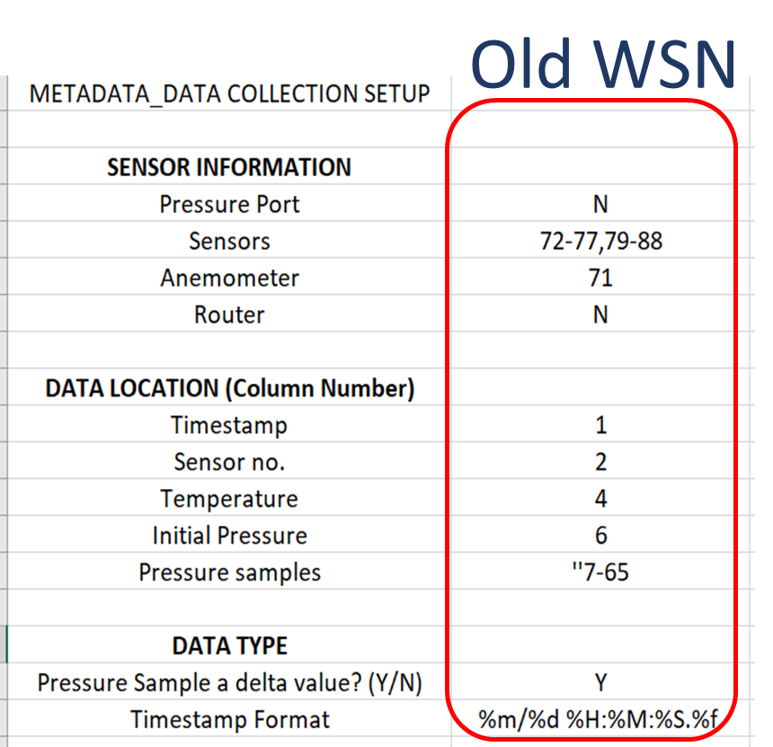
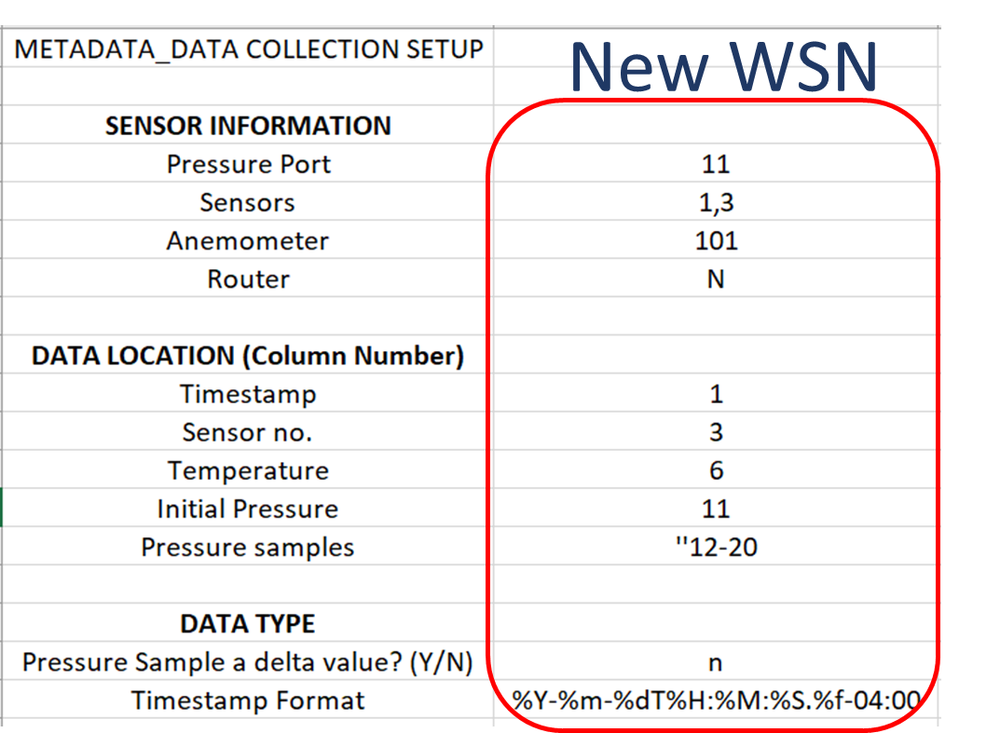
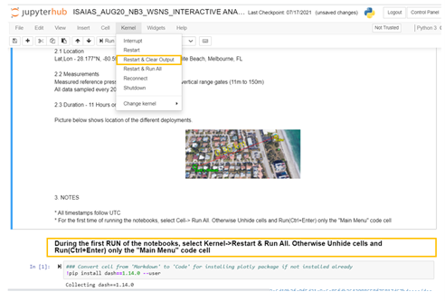
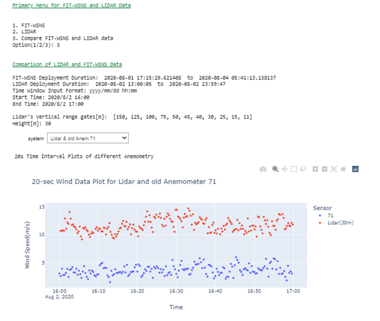
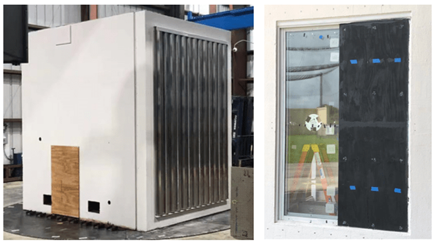
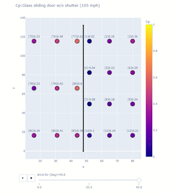
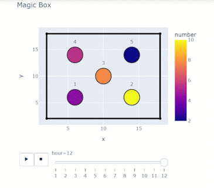

# Wind Data Analysis Tools

**Authors, Affiliations**  

The Florida Tech (FIT) hurricane team deploys networks of wireless sensors on residential houses during high impact wind events or on full scale wind tunnel models. The team deploys pressure, temperature and humidity sensors alongside anemometry, which includes different anemometers and a lidar(Hadley?). The workflow starts with uploading the data to DesignSafe through aunthentication tokens created in Tapis. Once on DesignSafe, three Jupyter notebooks process and visualize the instruments’ data for analyses. The notebooks provide a user friendly and interactive environment that can adapt to different datasets. For this project, the notebooks perform quasi static real-time analyses, assess sensor performance, study pressure variations for different wind conditions and data correlation. The user interactivity of these notebooks facilitates an easy adaptation to different datasets with little to no-change in code.

<p align="center">


## Background 

### Citation and Licensing

* Please cite [AUTHORS et al. (20xx) - example of published project](https://doi.org/10.17603/ds2-3zdj-493) to acknowledge the use of any resources from this use case.

* Please cite [Rathje et al. (2017)](https://doi.org/10.1061/(ASCE)NH.1527-6996.0000246) to acknowledge the use of DesignSafe resources.  

* This software is distributed under the GNU General Public License (https://www.gnu.org/licenses/gpl-3.0.html).  

Using Tapis for Data Uploads in Quasi-real time

The user needs a DesignSafe-CI (DS) account. During deployment, data is uploaded to DS in user defined time interval. Tapis CLI(full form? AND insert links to download them) and Python 3 enable this feature and must be installed on the local system. The user initiates Tapis before every deployment through Windows PowerShell and Tapis creates a token as described below:
1.	Turn on Windows Power Shell and enter the command tapis auth init –interactive.  
2.	For the tenant name, enter designsafe. 
3.	Enter the DesignSafe username and password of the authorized user. 
4.	You can choose to set up Container registry access and Git server access, or skip this step by pressing the return key if you do not wish to do so. 
5.	Create a token using the command tapis auth tokens create. At the end, the following response will appear on the cmd line. 

<p align="center">


Using Jupyter Notebooks

To save time and memory, three different notebooks address the project objectives. The figure below illustrates the resulting workflow and the sections below describe the notebooks in detail.The first notebook is a user-interactive guide to enter important raw file definitions such as formats, column numbers and sensor information, and is used only once(REPHRASE). This notebook gathers the information necessary to transform datasets with a variety of formats into a standard format. The second notebook calibrates raw data and organizes them into csv and pickled files. The third and final notebook is also user interactive, and helps users analyze and visualize the data.  [For any given field deployment or wind tunnel experiment, the first notebook inputs metadata for the dataset.and second notebooks are typically used once for any given dataset. The third notebook is the frequently used notebook and run everytime need not be executed in sequence every time analysis is done and depends on the type of user and stage of analysis as illustrated in the figure below. ]integrate...

<p align="center">


Adapting to Different Datasets

The first notebook is a user interactive guide to input important raw data information. This notebook saves time as the user does not have to read, understand and edit the code to change information regarding sensors, columns and data formats. WSNS deployment during the tropical storm Isaias (8/2/2020) used an old and a new wsns system. Both had significant differences in how data was stored, and the first notebook was used to document them. This helps in faster data processing as there is no change required in code and the file generated by the notebook acts as a metadata for the second notebook responsible for data processing. The figure below are snapshots of the output file created by the first notebook describing raw data information from two different systems.

<p align="center">    



## Jupyter Notebook

Analysis Notebooks and Examples

Florida Tech team’s project goal is to measure pressure variation on non-structural components during strong wind events using their network of wireless sensors. The analysis notebooks on DesignSafe are user interactive with markdowns describing the test and also act as a guide to help the user look at the data they desire. An example of this is the analysis notebook for Isaias (tropical storm on August 1-3, 2020). The markdowns have important information and pictures from the deployment, and instructions for the user to easily access data.

<p align="center">    


And a menu allows user to select from options and look at specific time windows or test conditions.

<p align="center">    


Using Plotly for Data Driven Animation Frames

The project objective is to study high impact wind events on non-structural components of residential houses. After the deployment, Jupyter notebooks process and visualize the important data that could be compared to ASCE 7 standards. A small part of that is assessing sensor performance with respect to wind conditions. Plotly is beneficial in creating animation frames to look at a snapshot of data from all sensors in different test conditions or even at different timestamps.  A single line of code enabled with the right dataframe can help in quickly looking at the trends and troubleshooting any system errors. The figure below shows an application of plotly for one of the wall of wind tests for glass sliding doors. The test model was a mock-up box with flat roof, and full scale glass sliding doors at 105 mph were tested at different wind directions. At uniform velocity, data for each wind direction was collected for 3 minutes and the program computed pressure coefficient Cp values averaged over that time window. A 2D scatter plot was created with x and z dimensions with each point representing a sensor whose color corresponded to a Cp value on the color scale. Important information is pieced together easily in a single line to enable the animation frame:
px.scatter(dataframe, x=x column, y=y column, color=scatter point values, text=text to be displayed for each point, range_color=color scale range, animation_frame=variable for each animation frame, title = plot title)
To add more clarity, additional lines of code describing indentations, dimensions and trace lines can be added.

<p align="center">    



As an example to using this plotly feature, an exercise has been described below:
Requirements:
Jupyter Notebook and if you don’t have it, get it here to have it on local system (Anaconda Navigator) or here on cloud (link to google collab)!
Once you have your notebook open and you don’t have plotly dash installed, go ahead and use: !pip install dash==1.14.0 –user
Building the Dataframe:
Consider a box of spheres that change their numbers ranging from 1 to 10 every hour. You want to look at how the number changes for 12 hours.

### Code

#Importing libraries
import random
import pandas as pd

#Define necessary columns
```spheres=[1,2,3,4,5]
x=[6,14,10,6,14]
y=[6,6,10,14,14]
rad=[]
for i in range (0,5): #generates 5 random numbers ranging from 1 to 10
    n = random.randint(1,10)
    rad.append(n)
hour=1
Label = ['1','2','3','4','5']

df=pd.DataFrame(spheres,columns=['Sphere']) #dataframe for first hour
df['x']=x
df['y']=y
df['number']=rad
df['hour']=hour
df['label']=Label
for i in range (0,11): #for loop to repeat for the next 11 hours
    hour=hour+1
    temp=pd.DataFrame(spheres,columns=['Sphere'])
    temp['x']=x
    temp['y']=y
    rad=[]
    for i in range (0,5):
        n = random.randint(1,10)
        rad.append(n)
    temp['number']=rad
    temp['hour']=hour
    temp['label']=Label
    df=df.append(temp)  
    
print(df)
```

Matching the right columns to suit the syntax will result in an animation frame and a slider!
import plotly.express as px
import plotly.graph_objects as go

``` fig = px.scatter(df, x='x',y='y', color='number',text="label", animation_frame='hour',title='Magic Box') #animation frame
fig.update_traces(textposition='top center',mode='markers', marker_line_width=2, marker_size=40)                      
trace1 = go.Scatter(x=[2, 2], y=[2, 18],line=dict(color='black', width=4),showlegend=False) #Tracelines to create the box
trace2 = go.Scatter(x=[2, 18], y=[18, 18],line=dict(color='black', width=4),showlegend=False)
trace3 = go.Scatter(x=[18, 18], y=[18, 2],line=dict(color='black', width=4),showlegend=False)
trace4 = go.Scatter(x=[18, 2], y=[2, 2],line=dict(color='black', width=4),showlegend=False)
fig.add_trace(trace1)
fig.add_trace(trace2)
fig.add_trace(trace3)
fig.add_trace(trace4)
fig.update_layout(autosize=False,width=500,height=500,showlegend=True)
fig.show()
```
<p align="center">


•	Published Datasets and Notebooks
o	Wang, M. Splitt, H. Besing, S. Sridhar. (2021), in Hurricane ISAIAS Data from Wireless Pressure Sensor Network and LIDAR. DesignSafe-CI. https://doi.org/10.17603/ds2-6qnj-tv17
