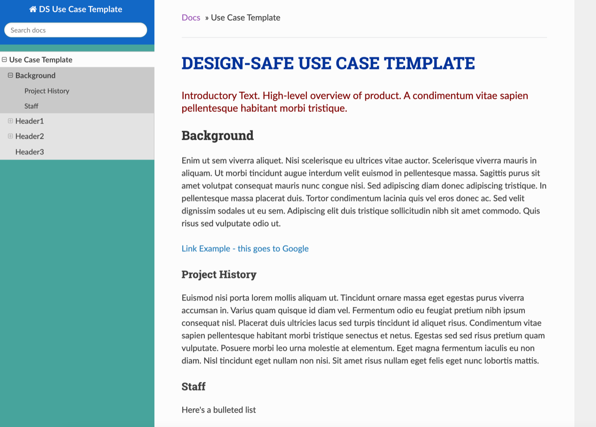

# Wind Data Analysis Tools

**Authors, Affiliations**  

The Florida Tech (FIT) hurricane team deploys wireless sensor networks on residential houses and full scale models during high impact wind events and wind tunnel testing. The team deploys pressure, temperature and humidity sensors alongside anemometers and Lidar over periods of time. Three Jupyter notebooks process and visualize the instruments’ data for correlation and further analyses. The notebooks provide a user friendly and interactive environment that can adapt to different datasets. For this project, the notebooks perform quasi static real-time analyses, assess sensor performance, study pressure variations for different wind conditions and data correlation. The user interactivity of these notebooks enables little to no-change in code as it adapts easily to different datasets.

## Background 

### Citation and Licensing

* Please cite [AUTHORS et al. (20xx) - example of published project](https://doi.org/10.17603/ds2-3zdj-493) to acknowledge the use of any resources from this use case.

* Please cite [Rathje et al. (2017)](https://doi.org/10.1061/(ASCE)NH.1527-6996.0000246) to acknowledge the use of DesignSafe resources.  

* This software is distributed under the GNU General Public License (https://www.gnu.org/licenses/gpl-3.0.html).  

### Description 

•	Subheading 1.1 - Using Tapis for Quasi-real time data 
o	The user needs DesignSafe-CI (DS) account. During deployment, data is uploaded to DS in user defined time interval. Tapis CLI and Python 3 enable this feature and must be installed on the local system. The user initiates Tapis before every deployment through Windows PowerShell and Tapis creates a token as described below:
1.	Turn on Windows Power Shell and enter the command tapis auth init –interactive.  
2.	For the tenant name, enter designsafe. 
3.	Enter the DesignSafe username and password of the authorized user. 
4.	You can choose to set up Container registry access and Git server access, or skip this step by the return key if you if you do not wish to do so. 
5.	Create a token using the command tapis auth tokens create. At the end, the following respond will be shown on the cmd line. 


[Link Example - this goes to Google](https://www.google.com)

## Header 2

•	Subheading 1.2 - Using Jupyter Notebooks
o	Project objectives were separated into three different notebooks to save time and memory. The first notebook is a user-interactive guide to enter important raw file definitions such as formats, column numbers and sensor information. This enables flexibility in code to adapt to any improvements made to the raw data. The second notebook calibrates raw data and organizes them to csv and pickled files. The third and final notebook is also user interactive and helps user analyze and visualize data. The notebooks need not be executed in sequence every time analysis is done and depends on the type of user and stage of analysis as illustrated in the figure below.


### Header2 Subheading

•	Subheading 1.3 - Adapting to Different Datasets
o	The first notebook is a user interactive guide to input important raw data information. This notebook saves time as the user does not have to read, understand and edit the code to change information regarding sensors, columns and data formats. WSNS deployment during the tropical storm Isaias (8/2/2020) used an old and a new wsns system. Both had significant differences in how data was stored, and the first notebook was used to document them. This helps in faster data processing as there is no change required in code and the file generated by the notebook acts as a metadata for the second notebook responsible for data processing. The figure below are snapshots of the output file created by the first notebook describing raw data information from two different systems.


*Add images to the folder img and use relative path to specify the location of the image.*   


> Use case template design


## Jupyter Notebook

•	Subheading 2.1 - Analysis Notebooks and Examples
o	Florida Tech team’s project goal is to measure pressure variation on non-structural components during strong wind events using their wireless sensor networks. The analysis notebooks on DesignSafe are user interactive with markdowns describing the test and also act as a guide to help the user look at the data they desire. An example of this is the analysis notebook for Isaias (tropical storm on August 1-3, 2020). The markdowns have important information and pictures from the deployment, and instructions for the user to easily access data.


Numbered list 

1. [numbered linked item](https://maps.google.com)
2. second item
3. third item

### Header3 subheading

Ac feugiat sed lectus vestibulum mattis ullamcorper. Et egestas quis ipsum suspendisse ultrices gravida dictum fusce ut. Scelerisque eu ultrices vitae auctor eu augue ut lectus arcu.  Imperdiet proin fermentum leo vel orci porta non pulvinar. Dictumst quisque sagittis purus sit amet. Aliquam purus sit amet luctus. Aliquet bibendum enim facilisis gravida neque convallis a cras. Orci porta non pulvinar neque laoreet suspendisse. Urna neque viverra justo nec ultrices dui.

**Example Table**

| Column 1 | Column 2 | Column 3 |
|----------|----------|----------|
| Stampede2| CPU      | 2017     |     
| Frontera | CPU & GPU| 2019     |     

Or use markdown table generator: [https://www.tablesgenerator.com/markdown_tables](https://www.tablesgenerator.com/markdown_tables)


### Math

To generate math equations in markdown.

For inline mode formulas: $`a^2+b^2=c^2`$.

For display mode formulas which appear on a separate line
```math
f(x) = \int_{-\infty}^\infty
\hat f(\xi)\,e^{2 \pi i \xi x}
\,d\xi
```

### Code

#Importing libraries
import random
import pandas as pd

#Define necessary columns
spheres=[1,2,3,4,5]
x=[6,14,10,6,14]
y=[6,6,10,14,14]
rad=[]
for i in range (0,5): #generates 5 random numbers ranging from 1 to 10
    n = random.randint(1,10)
    rad.append(n)
hour=1
Label = ['1','2','3','4','5']

df=pd.DataFrame(spheres,columns=['Sphere']) #dataframe for first hour
df['x']=x
df['y']=y
df['number']=rad
df['hour']=hour
df['label']=Label
for i in range (0,11): #for loop to repeat for the next 11 hours
    hour=hour+1
    temp=pd.DataFrame(spheres,columns=['Sphere'])
    temp['x']=x
    temp['y']=y
    rad=[]
    for i in range (0,5):
        n = random.randint(1,10)
        rad.append(n)
    temp['number']=rad
    temp['hour']=hour
    temp['label']=Label
    df=df.append(temp)  
    
print(df)


``` python
import tensorflow as tf
```

Highlight specific lines of the code (plotting)
Matching the right columns to suit the syntax will result in an animation frame and a slider!
import plotly.express as px
import plotly.graph_objects as go

fig = px.scatter(df, x='x',y='y', color='number',text="label", animation_frame='hour',title='Magic Box') #animation frame
fig.update_traces(textposition='top center',mode='markers', marker_line_width=2, marker_size=40)                      
trace1 = go.Scatter(x=[2, 2], y=[2, 18],line=dict(color='black', width=4),showlegend=False) #Tracelines to create the box
trace2 = go.Scatter(x=[2, 18], y=[18, 18],line=dict(color='black', width=4),showlegend=False)
trace3 = go.Scatter(x=[18, 18], y=[18, 2],line=dict(color='black', width=4),showlegend=False)
trace4 = go.Scatter(x=[18, 2], y=[2, 2],line=dict(color='black', width=4),showlegend=False)
fig.add_trace(trace1)
fig.add_trace(trace2)
fig.add_trace(trace3)
fig.add_trace(trace4)
fig.update_layout(autosize=False,width=500,height=500,showlegend=True)
fig.show() 


``` python hl_lines="3 4"
""" Bubble sort """
def bubble_sort(items):
    for i in range(len(items)):
        for j in range(len(items) - 1 - i):
            if items[j] > items[j + 1]:
                items[j], items[j + 1] = items[j + 1], items[j]
```
